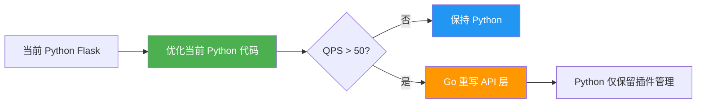

# 御风面板（bt_simple）项目深度分析报告

> 本报告从 **执行效率**、**安全性**、**资源占用** 三个维度进行专业审计，并回答是否需要将高频 Python 模块改写为编译型语言的问题。

---

## 一、执行效率问题

### 1.1 `execShell()` 滥用 — ⚠️ 高优先级

| 文件 | 问题 |
|------|------|
| [mw.py](file:///d:/git/gitea/bt_simple/web/core/mw.py) L32-71 | 核心 `execShell()` 使用 `subprocess.Popen` + `time.sleep(0.1)` 轮询等待，每次执行会阻塞至少 100ms |
| [firewall.py](file:///d:/git/gitea/bt_simple/web/utils/firewall.py) | 单次防火墙操作最多调用 4-6 次 `mw.execShell()`，每次启动独立子进程 |
| [site.py](file:///d:/git/gitea/bt_simple/web/utils/site.py) | 站点管理大量使用 `mw.execShell('mkdir')` / `mw.execShell('rm -rf')` 代替 Python 原生 `os.makedirs()` / `shutil.rmtree()` |

**改进建议：**
- `execShell()` 中的 `time.sleep(0.1)` 轮询改为 `sub.wait(timeout=timeout)` 或 `sub.communicate(timeout=timeout)`，直接消除 100ms 级延迟
- 文件/目录操作 (`mkdir`, `rm -rf`, `cp`, `chmod`, `chown`, `ln -sf`) 全部替换为 Python 原生 API：`os.makedirs()`, `shutil.rmtree()`, `shutil.copy2()`, `os.chmod()`, `os.chown()`, `os.symlink()`
- 对于防火墙类批量 shell 调用，考虑合并为单条命令或使用 subprocess 的 pipe chain

### 1.2 数据库连接无复用 — ⚠️ 高优先级

| 文件 | 问题 |
|------|------|
| [db.py](file:///d:/git/gitea/bt_simple/web/core/db.py) L29-56 | `Sql` 类每次操作创建新的 `sqlite3.connect()`，无连接池 |
| [orm.py](file:///d:/git/gitea/bt_simple/web/core/orm.py) L103-113 | MySQL ORM 每次 `execute/query` 都重新 `__Conn()` 建立连接再关闭 |
| [isLogined()](file:///d:/git/gitea/bt_simple/web/admin/common.py) L17-37 | 每次请求都执行 DB 查询验证登录状态，无缓存 |

**改进建议：**
- SQLite 使用 `check_same_thread=False` + 线程级连接池（如 `threading.local()` 持有连接）
- MySQL ORM 引入连接池（如 `DBUtils.PooledDB` 或 `pymysql` 的 pool）
- `isLogined()` 结果增加短期内存缓存（结合 session id 做 key，TTL 10-30s），避免每个请求都查 DB

### 1.3 插件状态检查效率低

| 文件 | 问题 |
|------|------|
| [plugin.py](file:///d:/git/gitea/bt_simple/web/utils/plugin.py) L794-800 | `checkStatusThreads()` 通过 `self.run()` 执行 shell `status` 命令检查每个插件 |
| [panel_task.py](file:///d:/git/gitea/bt_simple/panel_task.py) L235-246 | `panelPluginStatusCheck()` 每 60s 轮询所有插件状态 |

**改进建议：**
- 插件状态检查改为事件驱动（安装/卸载/启停时主动更新缓存），而非定时全量轮询
- 用 `os.path.exists(pid_file)` 或 `psutil.pid_exists()` 做快速判活，而非 shell 调用

### 1.4 文件 I/O 缺乏缓冲

| 文件 | 问题 |
|------|------|
| [mw.py](file:///d:/git/gitea/bt_simple/web/core/mw.py) L500-524 | `readFile()` / `writeFile()` 每次完整读写，频繁操作同一配置文件时性能差 |
| [mw.py](file:///d:/git/gitea/bt_simple/web/core/mw.py) L464-475 | `getPathSize()` 遍历目录计算大小，大目录时非常慢 |
| [mw.py](file:///d:/git/gitea/bt_simple/web/core/mw.py) L956-967 | `returnMsg()` 每次调用都读取语言 JSON 文件并 `json.loads` 解析 |

**改进建议：**
- 配置文件读取增加 LRU 缓存（`functools.lru_cache` 或基于 mtime 的简单缓存）
- 语言文件在启动时一次性加载到内存，或使用 `flask_caching` 已有的缓存组件
- `getPathSize()` 考虑使用 `du -sb` 命令或缓存结果

### 1.5 后台任务线程模型

| 文件 | 问题 |
|------|------|
| [panel_task.py](file:///d:/git/gitea/bt_simple/panel_task.py) L212-219 | `startPanelTask()` 使用 `while True + sleep(5)` 轮询任务表 |
| [panel_task.py](file:///d:/git/gitea/bt_simple/panel_task.py) L409-441 | 6 个后台守护线程，全部是 `while True + sleep()` 模式 |

**改进建议：**
- 任务队列改用 `threading.Event` 或 `queue.Queue`，有新任务时 `triggerTask()` 触发 event，无任务时阻塞等待，避免空轮询
- 合并低频守护线程（`openrestyRestartAtOnce` 和 `restartPanelService` 可合并为一个文件信号检测线程）

---

## 二、安全性问题

### 2.1 命令注入风险 — 🔴 严重

| 文件 | 位置 | 问题 |
|------|------|------|
| [mw.py](file:///d:/git/gitea/bt_simple/web/core/mw.py) L32 | `execShell()` | `shell=True` 直接拼接命令字符串，无转义 |
| [firewall.py](file:///d:/git/gitea/bt_simple/web/utils/firewall.py) L402-452 | `addAcceptPortCmd()` | 端口/IP 参数直接拼入 shell 命令 |
| [site.py](file:///d:/git/gitea/bt_simple/web/utils/site.py) L43-58 | 构造函数 | 路径直接拼入 `mkdir -p` / `chmod` 命令 |
| [mw.py](file:///d:/git/gitea/bt_simple/web/core/mw.py) L538 | `backFile()` | `os.path.format()` 拼接文件路径到 `cp` 命令 |
| [mw.py](file:///d:/git/gitea/bt_simple/web/core/mw.py) L550 | `removeBackFile()` | `rm -rf` + 路径直接拼接 |
| [plugin.py](file:///d:/git/gitea/bt_simple/web/utils/plugin.py) L323 | `install()` | 插件名和版本号直接拼入 `bash` 命令 |

**影响：** 攻击者如果能控制 port、IP、路径、插件名等输入参数，可构造类似 `; rm -rf /` 的注入

**改进建议：**
- 所有外部输入必须通过 `shlex.quote()` 转义后才能拼入 shell 命令
- 尽可能使用 `shell=False` + 参数列表模式 `subprocess.Popen(['cmd', 'arg1', 'arg2'])`
- 对端口/IP/路径做严格白名单校验（项目中 [vilidate.py](file:///d:/git/gitea/bt_simple/web/utils/vilidate.py) 只有验证码逻辑，应扩展为输入校验模块）

### 2.2 AES 加密使用硬编码默认密钥 — 🔴 严重

| 文件 | 位置 | 问题 |
|------|------|------|
| [mw.py](file:///d:/git/gitea/bt_simple/web/core/mw.py) L1304 | `aesEncrypt()` | 默认 Key = `ABCDEFGHIJKLMNOP`，IV = `0102030405060708` |
| [mw.py](file:///d:/git/gitea/bt_simple/web/core/mw.py) L1342 | `aesDecrypt()` | 同上 |

**改进建议：**
- 移除函数签名中的默认 key/iv，强制调用方显式传入
- 密钥应从安全存储读取（如数据库的独立密钥表、环境变量或硬件安全模块）

### 2.3 SSL 证书签名使用 MD5 — 🔴 严重

| 文件 | 位置 | 问题 |
|------|------|------|
| [mw.py](file:///d:/git/gitea/bt_simple/web/core/mw.py) L1968 | `createLocalSSL()` | `cert.sign(key, 'md5')` 使用 MD5 签名 |

**改进建议：**
- 自签证书签名算法改为 `sha256`：`cert.sign(key, 'sha256')`

### 2.4 API 认证安全缺陷 — 🟡 中等

| 文件 | 位置 | 问题 |
|------|------|------|
| [user_login_check.py](file:///d:/git/gitea/bt_simple/web/admin/user_login_check.py) L30-40 | `panel_login_required` | API 的 `App-Secret` 明文存储和传输于 HTTP Header |
| [user.py](file:///d:/git/gitea/bt_simple/web/thisdb/user.py) L44 | `initAdminUser()` | 初始密码明文写入 `default.pl` 文件 |

**改进建议：**
- API 认证改用 HMAC 签名机制：客户端用 Secret 对请求体签名，服务端验证签名，Secret 不在网络上传输
- 初始密码文件生成后提示用户修改，且设置文件权限为 `0600`

### 2.5 CSRF 防护不完善 — 🟡 中等

| 文件 | 位置 | 问题 |
|------|------|------|
| [\_\_init\_\_.py](file:///d:/git/gitea/bt_simple/web/admin/__init__.py) L157-168 | `requestCheck` | 仅靠 Referer/Origin 校验，可被伪造 |

**改进建议：**
- 引入 CSRF Token 机制（Flask-WTF 或自行实现 Double Submit Cookie）
- 所有 POST 请求携带并验证 CSRF Token

### 2.6 Session 安全

| 文件 | 位置 | 问题 |
|------|------|------|
| [\_\_init\_\_.py](file:///d:/git/gitea/bt_simple/web/admin/__init__.py) L80-90 | Session 配置 | `SESSION_PERMANENT = True` + 31 天过期，过长 |
| [\_\_init\_\_.py](file:///d:/git/gitea/bt_simple/web/admin/__init__.py) L84-85 | Cookie 属性 | 非 HTTPS 时无 `Secure` 标志 |

**改进建议：**
- Session 有效期缩短为 1-7 天
- 增加 Session 绑定 IP 机制（IP 变化时强制重新登录）
- 增加最大同时在线 Session 数限制

### 2.7 SocketIO 跨域配置 — 🟡 中等

| 文件 | 位置 | 问题 |
|------|------|------|
| [\_\_init\_\_.py](file:///d:/git/gitea/bt_simple/web/admin/__init__.py) L221 | SocketIO 初始化 | `cors_allowed_origins="*"` 允许任意来源 |

**改进建议：**
- 限制 `cors_allowed_origins` 为面板自身域名/IP

### 2.8 Python 2 兼容代码残留

| 文件 | 位置 | 问题 |
|------|------|------|
| [mw.py](file:///d:/git/gitea/bt_simple/web/core/mw.py) L50, L1473-1487, L1534-1545 | `HttpGet/HttpPost` | 大量 `sys.version_info[0] == 2` 分支 |
| [mw.py](file:///d:/git/gitea/bt_simple/web/core/mw.py) L652 | `getFileMd5()` | 使用已废弃的 `file()` 内建函数 |

**改进建议：**
- 项目入口已限制 Python ≥ 3.6，应彻底清除所有 Python 2 兼容代码
- `getFileMd5()` 中的 `file()` 改为 `open()`

### 2.9 ORM SQL 注入风险 — 🟡 中等

| 文件 | 位置 | 问题 |
|------|------|------|
| [orm.py](file:///d:/git/gitea/bt_simple/web/core/orm.py) L103-113, L129-142 | `execute()` / `query()` | 接受原始 SQL 字符串，无参数化查询保护 |

**改进建议：**
- MySQL ORM 的 `execute()` 和 `query()` 增加参数化查询支持（类似 SQLite `Sql` 类的 `param` 参数）

---

## 三、资源占用问题

### 3.1 内存

| 问题 | 详情 |
|------|------|
| 依赖膨胀 | `requirements.txt` 引入 `pymongo`, `pymemcache`, `redis` 等，但面板核心仅用 SQLite，这些库常驻内存占用 20-50MB |
| 语言文件反复读取 | `returnMsg()` 每次调用解析 JSON，导致重复内存分配 |
| 单例模式内存泄漏隐患 | `Firewall`, `sites`, `plugin` 类使用单例 + `threading.Lock`，实例永不释放 |

**改进建议：**
- 非核心依赖（`pymongo`, `pymemcache`, `redis` 等）改为 lazy import（在相关插件中按需导入）
- 静态数据（语言文件、插件 info.json）启动时加载到内存，后续直接引用

### 3.2 CPU

| 问题 | 详情 |
|------|------|
| 6 个后台线程持续轮询 | 即使系统空闲，每秒也有多次 `sleep → 醒来 → 检查文件/DB → sleep` 循环 |
| `systemTask()` 每 5 秒采集系统监控 | 包含 `psutil` 的 CPU/内存/磁盘/网络采样 |
| GitHub 代理测速阻塞 | `getGithubProxyInfo()` 在缓存失效时同步执行 4 次 `curl` 测速 |

**改进建议：**
- 后台线程改用事件驱动或信号量等待
- 系统监控采样间隔可配置化（默认 10-30s 足够）
- GitHub 代理测速改为异步执行，不阻塞请求

### 3.3 磁盘 I/O

| 问题 | 详情 |
|------|------|
| 进度文件频繁写入 | `writeSpeed()` 写入 `panel_speed.pl`，下载时可能每秒写数十次 |
| 通知锁文件 | `notifyMessageTry()` 每次通知读写 `notify_lock.json` |
| 日志双写 | `panel_task.py` 同时写全局日志和任务独立日志 |

**改进建议：**
- 进度信息改用内存变量 + WebSocket 推送，减少磁盘写入
- 通知锁改用内存时间戳（`time.time()` 变量）替代文件锁

---

## 四、是否需要改写为编译型语言（C/Go/Rust）？

### 4.1 结论：**当前阶段不建议，但局部可考虑**

#### 不建议全面改写的原因：

```
┌─────────────────────────────────────────────────────────────────┐
│  当前性能瓶颈 ≠ Python 语言本身                                    │
│                                                                 │
│  ① 主要瓶颈在 I/O（shell 调用、文件读写、DB 查询）                   │
│     → 优化 I/O 模式比换语言效果大 10 倍以上                         │
│                                                                 │
│  ② 面板属于管理工具，QPS 极低（通常 < 10 req/s）                    │
│     → Python + Flask 完全够用                                     │
│                                                                 │
│  ③ 改写成本极高（2300+ 行核心 mw.py + 39 个插件）                   │
│     → 人力投入产出比不划算                                          │
│                                                                 │
│  ④ Python 的生态优势在于快速迭代和插件扩展                           │
│     → 面板的核心竞争力是功能丰富和响应迅速                             │
└─────────────────────────────────────────────────────────────────┘
```

#### 局部可以考虑改写的模块：

| 模块 | 适合改写的语言 | 理由 | 收益 |
|------|-------------|------|------|
| WAF 日志分析 / fail2ban 日志解析 | **Go** 或 **Rust** | 需要高频读取大文件、正则匹配、IP 聚合统计 | 10-50x 速度提升 |
| 系统监控数据采集 | **Go** | 替代 `psutil`，常驻后台，低开销 | 内存占用降低 60-80% |
| 文件校验（MD5/SHA256） | **C** 扩展 或 **Rust** | 大文件哈希计算是 CPU 密集型 | 2-5x 速度提升 |

> [!TIP]
> **推荐方式：** 将上述模块编译为独立二进制 CLI 工具，Python 通过 `subprocess` 调用（已有此模式），或编译为 Python C 扩展（`ctypes` / `cffi`）。这样改动最小，收益最大。

#### 如果未来确实要迁移，推荐路径：



---

## 五、优化优先级路线图

### 第一阶段 — 快速收益（1-2 周）

- [x] 修复命令注入漏洞（`shlex.quote()` + 输入校验）
- [x] SSL 签名算法 MD5 → SHA256
- [x] AES 移除硬编码默认密钥
- [x] `execShell()` 移除 `sleep(0.1)` 轮询
- [x] 清除 Python 2 兼容代码

### 第二阶段 — 架构优化（2-4 周）

- [ ] 文件/目录操作替换为 Python 原生 API
- [ ] SQLite 连接池化
- [ ] `isLogined()` 结果缓存
- [ ] 语言文件/插件信息一次性加载
- [ ] 后台线程改为事件驱动
- [ ] CSRF Token 机制

### 第三阶段 — 性能提升（可选）

- [ ] WAF 日志分析模块用 Go/Rust 重写
- [ ] 系统监控采集改为 Go CLI
- [ ] 进度信息改用 WebSocket 推送
- [ ] 非核心依赖 lazy import

---

## 六、代码质量快照

| 指标 | 当前状态 | 建议目标 |
|------|---------|---------|
| 核心模块行数 | [mw.py](file:///d:/git/gitea/bt_simple/web/core/mw.py) = 2326 行 | 拆分为 `mw_shell.py`, `mw_file.py`, `mw_crypto.py`, `mw_net.py` 等 |
| 站点管理行数 | [site.py](file:///d:/git/gitea/bt_simple/web/utils/site.py) = 2760 行 | 按功能拆分（SSL, 域名, 配置, 日志） |
| 异常处理 | 大量裸 `except:` / `except Exception` | 精确捕获异常类型，记录堆栈 |
| 类型标注 | 几乎无 | 核心 API 增加 Type Hints |
| 单元测试 | 无 | 核心模块覆盖率 > 60% |
