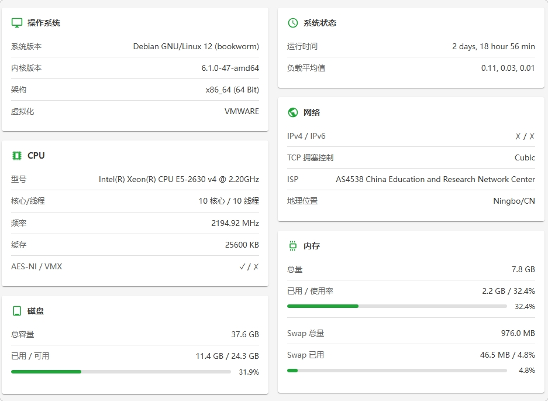

1. 宝塔迁移测试

2. 优化后的mysql、php（包含apt和编译）、openresty测试

3. 考虑是否要在脚本内置utf 8 中文支持

4. cdn开关，默认不开

5. 计划任务 同步系统存在计划

6. 御风防火墙 google 百度等爬虫的默认通过，需要做开关控制，默认打开

7. 系统状态展示参考

   



reids

```sh
Job for redis-server.service failed because the control process exited with error code. See "systemctl status redis-server.service" and "journalctl -xeu redis-server.service"for details.
```

