# 御风面板（BtSimple）使用与运维说明书

---

## 前言：什么是服务器管理面板？

对于大多数没有接触过命令行（也就是那种黑乎乎、只能敲键盘打字的窗口）的非技术用户来说，直接管理一台 Linux 服务器就像是在驾驶一架没有仪表盘的飞机。你需要记住成百上千个复杂的英文命令，一旦打错一个字母，就可能导致整个系统崩溃。

**御风面板（BtSimple）** 就是为了解决这个问题而诞生的。它是一个运行在您服务器上的“可视化管家”。它把复杂的 Linux 命令转换成您熟悉的网页界面。您只需要在网页上点击鼠标、填写表单，面板就会在后台帮您自动执行那些高难度的命令。

本说明书专门为**零基础用户**编写，我们将用最通俗易懂的语言，手把手带您从最基础的服务器常识开始，一步步掌握网站搭建、数据备份、安全加固等全套网络运维技能。

---

## 第一部分：网络运维与 Linux 服务器基础常识

在正式开始使用面板之前，您需要先了解几个网络世界里的“基础设施”。理解了这些概念，后续的操作才会得心应手。

### 1.1 什么是服务器与 Linux 操作系统？

- **服务器**：简单来说，服务器就是一台**7×24小时不关机、没有显示器、放在专业机房里**的特殊电脑。它的性能比我们家里的个人电脑更稳定，网络带宽也更大。它的唯一任务就是随时等待互联网上的用户来访问它里面的网页或数据。
- **Linux 操作系统**：我们平常用的电脑大多装的是 Windows 或 macOS，它们有漂亮的桌面和鼠标操作。而服务器为了追求极高的稳定性和极低的资源消耗，通常使用 **Linux 操作系统**（如 Ubuntu、Debian、CentOS 等）。Linux 默认是没有图形桌面的，所有操作都通过字符命令完成，这就是为什么我们需要“御风面板”来提供网页界面的原因。

### 1.2 什么是 IP 地址与端口号？

这是网络通信中最基础的两个概念，我们可以用**收寄快递**来作个生动的比喻：

- **IP 地址（Internet Protocol Address）**：这就像是**您家的小区地址**（例如：北京市朝阳区XX路XX号）。在互联网中，每一台服务器都有一个独一无二的数字编号，例如 `192.168.1.100` 或 `8.8.8.8`。通过这个 IP 地址，全世界的电脑才能在茫茫网海中找到您的服务器。
- **端口号（Port Number）**：这就像是**小区的单元门牌号**（例如：1单元101室、2单元202室）。一台服务器可以同时提供很多种服务（比如放网页、放数据库、用来登录等），每个服务都必须占用一个特定的通道，这个通道就是“端口”。端口的范围是从 `1` 到 `65535`。
  - 例如：默认的网页服务占用 `80` 和 `443` 端口；用于远程登录服务器的通道默认是 `22` 端口；御风面板默认的登录端口是特定的高位端口。如果关闭了某个端口，外面的人就无法访问该端口对应的服务。

### 1.3 什么是域名与 DNS 解析？

- **域名（Domain Name）**：IP 地址是一串冷冰冰的数字（比如 `110.242.68.66`），人类极难记住。因此，人们发明了域名——用英文字母和单词组成的地址，比如 `baidu.com` 或 `yfte.co`。
- **DNS 解析**：这就像是手机里的**电话簿**。当您在浏览器输入 `yfte.co` 时，您的电脑会自动询问“DNS 服务器”：“请问 `yfte.co` 对应的 IP 地址是多少？”DNS 服务器查表后告诉您的电脑：“它的 IP 是 `x.x.x.x`，请往这里发送请求。”这个把域名翻译成 IP 地址的过程，就叫做 **DNS 解析**。
  - **A 记录**：最常见的解析类型，把域名直接指向一个 IPv4 地址（如 `1.2.3.4`）。
  - **CNAME 记录**：别名解析，把域名指向另一个域名（常用于 CDN 加速或对象存储服务）。

### 1.4 什么是 Web 服务（Nginx/OpenResty）与网站的本质？

- **网页的本质**：我们在浏览器里看到的精美网页，在服务器上其实只是一些 HTML 代码文件、CSS 样式文件、图片和 JavaScript 脚本。
- **Web 服务器软件（如 Nginx 或 OpenResty）**：这就像是**商铺里的店小二**。当用户在浏览器输入网址请求访问网页时，Nginx 这个“店小二”就会在服务器的硬盘里找到对应的网页文件，然后打包通过网络发送给用户的浏览器，浏览器再把这些代码渲染成我们看到的画面。
- **OpenResty**：它是 Nginx 的升级加固版，集成了很多安全和加速模块。御风面板默认推荐并使用 OpenResty 作为网页的“店小二”。

### 1.5 什么是数据库？它有什么用？

- 如果把网站的静态网页文件比作“存放在书架上的书”，那么**数据库**就像是一个**智能电子表格或账本**。
- 当您的网站有“用户注册”、“发帖评论”、“商品下单”等动态交互功能时，这些用户账号、密码、文章内容、订单数据都必须结构化地保存在一个地方。这个负责高效存储、查询、修改数据的软件就叫**数据库**（如 **MySQL** 或 **MariaDB**）。

---

## 第二部分：御风面板安装部署与准备工作

在了解了基础常识后，我们现在开始着手准备您的第一台服务器，并把御风面板安装上去。

### 2.1 准备工作：如何购买并访问服务器

1. **购买服务器**：您可以通过各大云厂商（如阿里云、腾讯云、华为云、腾讯轻量云或海外的国外云主机商）购买一台 Linux 云服务器。
   - _系统选择推荐_：强烈建议选择 **Ubuntu 20.04 LTS / 22.04 LTS** 或 **Debian 11 / 12** 的 64位系统。这两种系统在御风面板下运行最为稳定高效。
2. **获取连接信息**：购买成功后，云厂商控制台会提供给您：
   - **公网 IP 地址**（例如：`123.45.67.89`）
   - **用户名**（通常默认是 `root`）
   - **密码** 或 **SSH 密钥文件**
3. **使用 SSH 客户端登录服务器**：
   - 在 Windows 电脑上，您可以下载安装 **Xshell**、**Tabby** 或 **Mobaxterm** 等工具。
   - 打开工具，新建连接，输入服务器的公网 IP，端口填 `22`（默认 SSH 端口），然后输入用户名 `root` 和对应的密码。
   - 如果成功连上，您会看到一个以 `root@xxxx:~#` 开头的命令行提示符。此时，您就可以输入安装命令了。

### 2.2 全新一键安装部署步骤

御风面板提供了一套全自动的智能部署脚本。无论您的服务器在国外还是国内，脚本都会自动识别并选择最快的路线。

请在您的 SSH 终端里，复制以下命令并按下回车键执行：

官方网站脚本：

```shell
curl --insecure -fsSL https://panel.yftec.top/deploy.sh | bash
```

Github脚本：

```bash
curl --insecure -fsSL https://raw.githubusercontent.com/clhome/bt_simple/refs/heads/master/deploy.sh | bash
```

#### 🇨🇳 针对中国大陆境内服务器的特殊说明

由于国内访问 GitHub（存储面板源码的地方）经常会遇到网络连接超时或彻底无法访问的问题，我们特别重构了**智能中转加速机制**。

1. **自动检测**：脚本在运行初期会自动测试您服务器的网络环境。如果发现是国内服务器，它会**自动且无感地**将下载源切换为国内高速镜像（如 `mirror.ghproxy.com` 以及清华大学的 Pip 源）。
2. **手动强制加速**：如果自动检测没有触发，而您的下载进度异常缓慢，您可以按 `Ctrl + C` 终止，然后使用以下命令强制开启中国区加速模式：

   ```bash
   curl --insecure -fsSL https://gh-proxy.org/https://raw.githubusercontent.com/clhome/bt_simple/refs/heads/master/deploy.sh | bash -s -- -cn
   ```

   _这能保证您在国内极劣质的网络环境下依然在 1-2 分钟内极速完成部署，免去了手动上传大文件的烦恼。_

### 2.3 为什么我的安装会失败？（新手避坑指南）

如果您在安装时遇到卡住或报错，通常是由以下两个原因引起的：

1. **云控制台防火墙未放行（安全组配置）**：云厂商（如阿里云、腾讯云）默认会在云端加一层安全锁，称为“安全组”。如果您的安全组没有开放常用的端口，哪怕面板在服务器里运行起来了，您的浏览器也打不开。
   - _解决方法_：前往您的云服务器控制台，找到“安全组”或“防火墙”设置，添加规则放行全部端口，或者放行您安装时命令行最后提示的面板特定端口。
2. **纯净系统冲突**：御风面板必须安装在**没有任何其他面板、没有手动配置过 Nginx/Apache/MySQL** 的“纯净系统”上。如果您的系统已经装过其他东西，极易发生端口冲突。
   - _解决方法_：在云厂商控制台重装系统（重置为干净的 Ubuntu/Debian），再重新运行安装命令。

### 2.4 从宝塔面板（BT.CN）平滑迁移与数据接管

如果您目前使用的是宝塔面板，但因为其日益臃肿、强制绑定手机号或有后门风险而想要迁移，御风面板提供了平滑的“零感接管”迁移机制。

#### 迁移三部曲：

1. **环境智能自检**：在您运行迁移脚本前，脚本会自动扫描并记录您原有宝塔中安装的所有软件版本（例如：您原先装的是 MySQL 5.7 和 PHP 7.4）。
2. **冲突路径安全隔离**：为了防止在重装时新旧文件冲突损坏数据，脚本会将宝塔的旧冲突物理路径（如 `/www/server/mysql` 等）进行安全的重命名备份（如改为 `mysql_bt_bak`），从而腾出干净的物理路径来执行纯净安装。
3. **智能环境依赖补全与鲁棒性增强**：
   考虑到各种 Linux 发行版极可能缺失 `zstd`、`unzip` 等解压或数据还原依赖包，迁移系统在执行接管前会启动自动化补全逻辑，保证宝塔压缩的数据备份包可稳妥还原。此外，在迁移启动阶段，脚本会自动停止旧有 MySQL 服务，规避进程残留导致的文件锁冲突。同时，系统能智能删除阻碍面板接管的 `user.ini` 锁定文件，并在后续自动通过内置模块安全重建。
4. **一键站点与数据融合接管**：
   在新面板成功拉起并自动在后台重新编译好对应版本的数据库和应用后，您可以通过以下两种方式无损迁移：
   - **命令行方式**：在 SSH 终端运行以下命令：
     ```bash
     bs migrate_restore
     # 或者运行 bs 打开图形化菜单，选择“恢复宝塔软件数据(迁移接管)”
     ```
     系统将自动无损恢复旧宝塔中的 MySQL 数据库及 Redis 缓存。
   - **面板网页可视化方式（推荐）**：如果您习惯网页端操作，可以在“**面板设置**”页面中，找到“**网站列表迁移**”按钮。点击后，系统会**自动扫描**备份的 `site.db` 文件，或者允许您手动输入其存放的绝对路径。点击开始后，系统会在后台以**无缓冲输出 (-u) **的模式进行异步读取，您可以在网页上**实时且毫无延迟地看到站点导入进度日志**。系统会自动解析站点名、物理路径、备注等，并进行站点名重复过滤与一键平滑接管，对新手极其友好。

### 2.5 首次登录面板安全自检

当安装命令执行完毕后，终端上会打印出一大段醒目的提示信息，包含：

- **面板外网访问地址**（通常是：`http://您的服务器IP:端口号/安全入口`）
- **初始用户名**
- **初始密码**

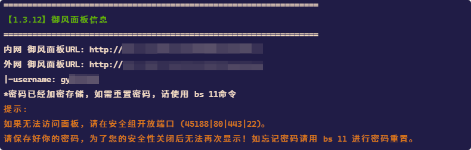

> [!CAUTION]
> **请务必复制并妥善保存这段信息。** 出于安全保护，如果不输入末尾的“安全入口”（一串随机英文字符），直接访问 IP 和端口会提示“安全入口校验失败”，这是为了防止黑客扫描您的面板登录页。

用浏览器打开面板外网地址，输入用户名和密码即可登入。


------


## 第三部分：面板全局界面布局与基础设置

御风面板在用户体验（UX）和界面设计（UI）上进行了颠覆性的革新。本章将为您拆解面板的视觉结构与系统全局设置。

### 3.1 界面结构设计与物理微交互

登录面板后，您会看到一个布局紧凑、高水准视觉保真的现代管理控制台。它的核心区域划分如下：

- **左侧导航菜单**：包含首页、网站、软件商店、文件、计划任务、安全、系统设置等常用模块。
- **上方状态栏**：显示当前系统负载、运行时间以及重启面板或服务器的快捷操作按钮。
- **核心卡片区域**：由系统状态（CPU与内存）、概览（网站与数据库数量）、软件格子（快速操作）、网络与磁盘 IO 四大部分组成。

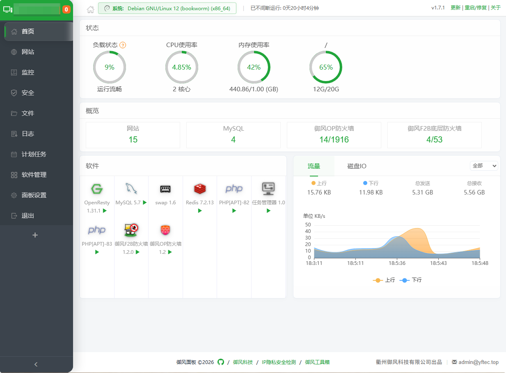

#### 物理微交互设计：

面板为所有卡片和交互按钮注入了“物理级弹性动效”：

1. **磨砂玻璃拟态（Glassmorphism）**：卡片背景采用 `backdrop-filter` 磨砂毛玻璃效果，并带有精美的弥散光影底色，在各种分辨率下都显得高级、有质感。
2. **物理悬浮（Hover）**：当您的鼠标悬停在某个软件格子或状态框上时，卡片会平滑向上悬浮并略微改变圆角大小，给您一种卡片“浮起来”的真实触觉反馈。
3. **按压陷落（Active）**：当您点击按钮或软件格子时，它会瞬间收缩到 `scale(0.96)`（96%大小），伴随弹性回馈，模拟物理按键被按下去的下沉手感。
4. **无滚动条的“一屏”高度**：首页的高度经过了极致压缩优化，在主流的笔记本和台式机显示器下，页面刚好铺满一屏，避免出现杂乱的多余滚动条。

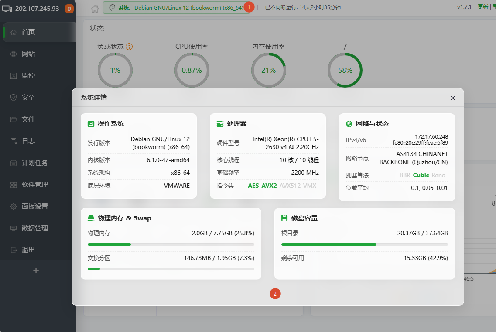

### 3.2 动态侧边菜单配置

如果您有一些模块不常用（比如平时不需要看监控或计划任务），或者想要改变左侧菜单的顺序：

- **自定义拖拽排序**：直接用鼠标按住左侧任意菜单项，上下拖动即可实时调整它们的位置。
- **菜单显隐配置**：在菜单栏底部点击设置，可以一键勾选隐藏或显示特定的功能模块。
- **零磁盘 I/O 架构**：这一排序功能在底层抛弃了繁重的数据库读写，采用“运行进程级内存缓存 + JSON文件持久化”。这意味着无论您刷新多少次网页，菜单的展示都不会对服务器硬盘造成任何读写压力，响应速度达到极致。

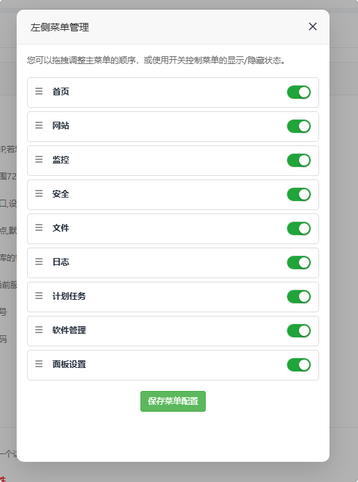

### 3.3 全局系统设置（Setting）安全配置详解

点击左侧“系统设置”，这是您服务器安全的核心堡垒。对于完全不懂运维的用户，请严格按照以下说明进行配置：

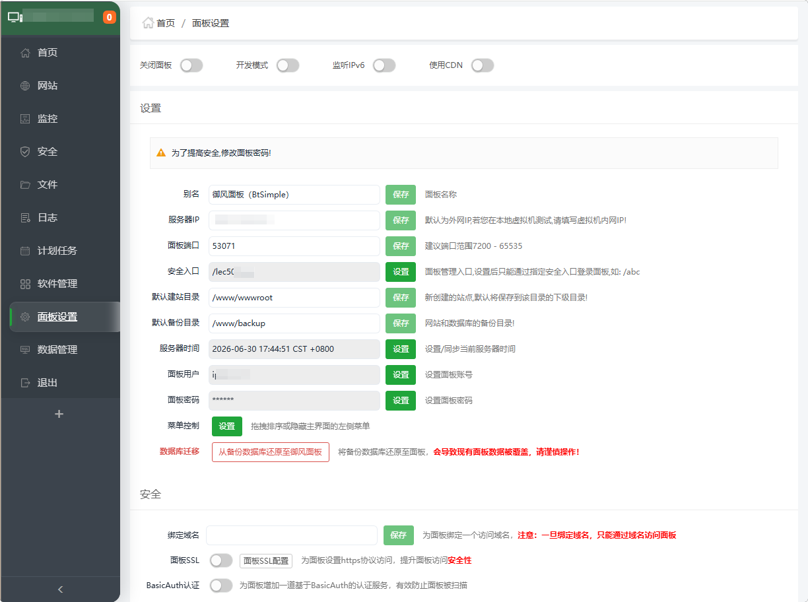

1. **修改面板端口（默认随机）**：
   - _为什么要改_：默认端口是公开且容易被黑客用工具扫描出来的。将其修改为一个只有您自己知道的端口（范围建议在 `10000` 到 `60000` 之间，如 `28763`），能大幅度降低面板被暴力破解的概率。
   - _重要提示_：修改后，请务必先去云服务器的安全组中放行该新端口，否则会导致您自己也打不开面板。
2. **修改安全入口（/入口名）**：
   - 安全入口是一层保护外衣。如果黑客知道了您的 IP 和端口，但不知道安全入口（比如 `/myadmin`），他们依然无法打开登录界面。
3. **绑定域名访问**：
   - 当您拥有自己的域名后，可以设置“只有通过该域名才能打开面板”。此后，直接通过 IP 地址访问面板将会被系统无情拒绝。这能彻底防御针对 IP 段的恶意网络扫描。
4. **安全入口授权 IP 白名单**：
   - 如果您拥有固定的宽带 IP（比如公司网络），可以设置“仅允许此 IP 访问面板”。非白名单内的任何电脑都无法打开面板登录页。
5. **修改面板管理员账密（bcrypt 加密存储）**：
   - _bcrypt 存储_：御风面板弃用了老旧的 MD5 加密，采用高强度单向哈希 `bcrypt` 算法对密码进行加密。即使服务器数据库被意外窃取，黑客也无法在有限的宇宙寿命内逆向解密出您的明文密码。
   - _修改建议_：请设置一个“大写字母+小写字母+数字+特殊符号”且长度大于 10 位的密码。

---

## 第四部分：核心功能模块手把手教程

### 4.1 网站管理 (Site) —— 如何从零搭建网站

在互联网中，搭建一个网站其实就是将您的域名与服务器上的一个存放网页代码的目录进行绑定。

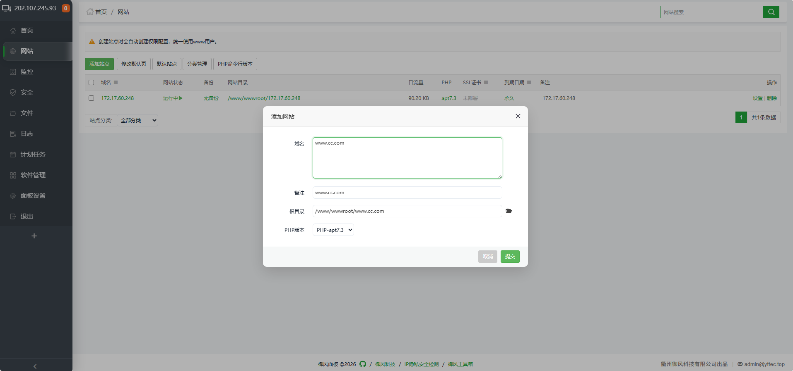


#### 步骤一：新建一个站点

1. 点击左侧的“网站”菜单，点击【添加网站】按钮。
2. **域名**：输入您已经解析到该服务器 IP 的域名（例如 `www.yourname.com`）。如果您想让用户输入不带 www 的域名也能访问，可以在文本框里换行输入 `yourname.com`。
3. **根目录**：系统会自动为您生成一个类似 `/www/wwwroot/yourname.com` 的文件夹路径。您的网站所有代码（HTML/PHP/图片等）将来都要上传到这个文件夹里。
4. **PHP版本**：如果您的网页需要运行 PHP 脚本（比如博客系统 WordPress），请在此处选择对应的 PHP 版本。如果是纯 HTML 静态页面，可以选择 `纯静态`。
5. 点击【提交】。恭喜您，您的网站框架已经搭建完成了！

#### 步骤二：SSL 证书配置（启用安全加密 HTTPS）

在现代网络中，如果您的网站没有启用 HTTPS（即网址开头是 `http://` 并在浏览器显示“不安全”或一把红色的叉），搜索引擎会降低您的权重，用户也会对网站产生不信任感。HTTPS 的核心就是安装 **SSL 证书**。

御风面板全面适配了**90天免费 SSL 证书的一键申请与自动续期**：

1. 在网站列表中，找到您刚刚新建的站点，点击右侧的【SSL】（或【未部署】）。
2. 选择“Let's Encrypt”或“ACME”选项卡。
3. **智能桥接申请**：御风面板会在后台自动创建一个临时桥接站点，无感完成 CA 机构的文件验证，免去了您手动下载验证文件并上传的麻烦。
4. 勾选您的域名，点击【申请】按钮。
5. 申请成功后，系统会自动为您配置好密钥，并将站点配置文件无感升级为 TLS 1.2+ 高安全通信协议。
6. **自动续期机制**：证书虽然只有 90 天有效期，但御风面板会在证书到期前 30 天，通过后台定时任务自动重新申请并替换，您无需进行任何手动操作。

_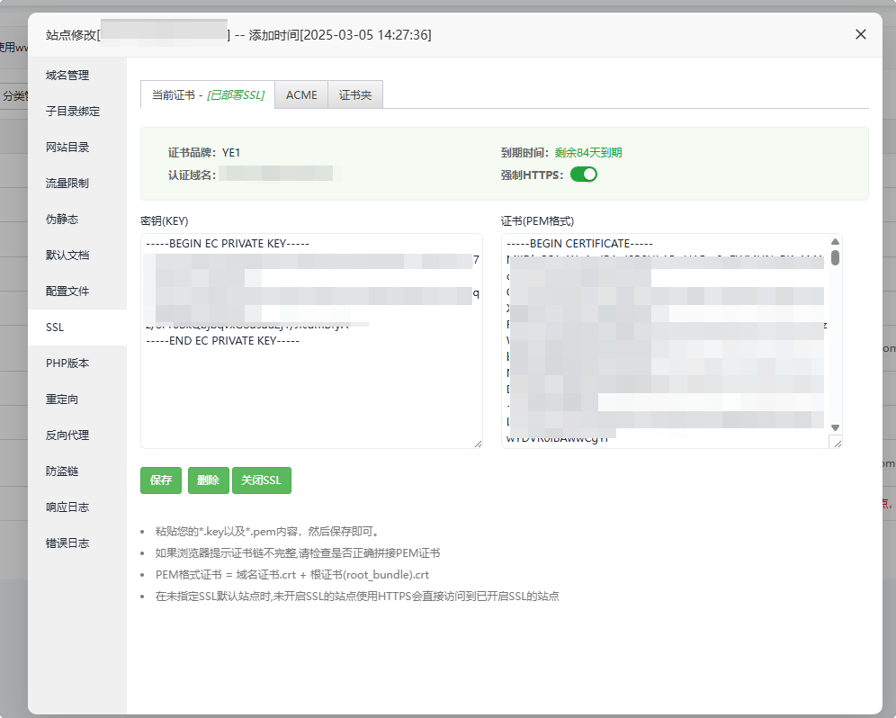_

#### 步骤三：伪静态规则（Rewrite）设置

- **什么是伪静态**：很多建站程序（例如 WordPress、Typecho、ThinkPHP）为了美观和 SEO 优化，会把带有问号和参数的链接（如 `index.php?p=123`）伪装成静态网页的样式（如 `/post-123.html`）。如果直接访问这些美化后的链接，服务器会报错 404。
- **配置方法**：在网站列表点击您站点的【设置】->【伪静态】，在下拉菜单中找到您正在使用的建站系统（如 `wordpress`），系统会自动填充对应的重写规则，点击保存即可。

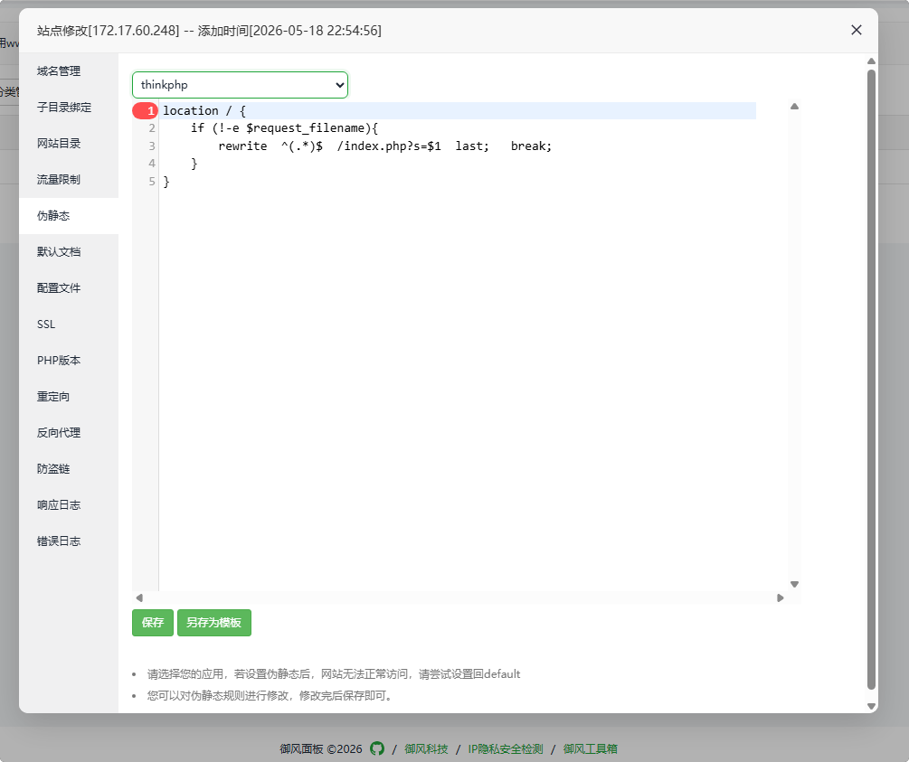

#### 步骤四：站点配置的导入与导出

为了方便站点的跨机迁移或快速配置复用，网站管理中新增了站点配置文件（Nginx Vhost Config）的一键导出与导入功能。您可以在站点设置面板中直接导出当前配置，或将已有的 Nginx 配置片段导入，系统将自动进行格式校验与平滑载入，免除了手动通过文件管理器寻找并编辑配置文件的繁琐步骤。

同时，为了提高运维效率，您可以在网站管理设置中自定义“默认跳转 Tab”（如直接定位到“配置文件”选项卡），当在列表中点击设置时，将直达您最常用的操作界面。

#### 4.2 文件管理 (Files) —— 像在本地电脑一样管理文件

网站建好后，我们需要把网页代码上传到服务器上。点击左侧“文件”菜单，这就是您的“云端资源管理器”。

_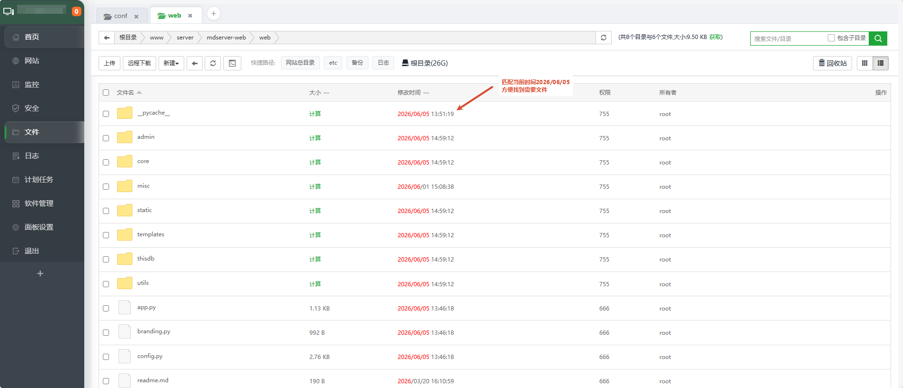

#### 特性一：多标签页浏览器体验

- 在传统的面板中，如果您要在 `/www/wwwroot/site1` 目录和 `/www/backup` 目录之间来回复制文件，您必须不停地点击返回、进入，非常繁琐。
- 御风面板引进了类似浏览器的**多标签页**设计。您可以同时打开多个不同的文件夹标签页，并在标签页之间直接进行文件复制、剪切和对比，本地状态会自动持久化。

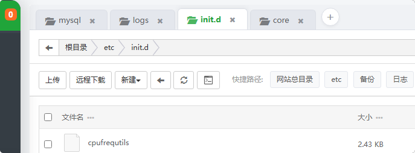

#### 特性二：全屏递归拖拽上传

- 如果您电脑上有一个写好网页的文件夹，传统方法需要先将其打包成 zip，上传到服务器，再在服务器里解压。
- 在御风面板中，您只需**直接将整个文件夹用鼠标拖入文件管理器的网页中心**。
- 面板会在前端自动建立预上传队列，递归解析您文件夹中的所有子目录，在服务器端原样创建对应的文件夹结构，并把所有文件自动逐一上传到位。

#### 特性三：同名覆盖大小精密比对

- 如果您拖入或上传的文件在服务器上已经存在同名文件，为了防止您一不小心覆盖了重要的数据，面板会弹出一个醒目的**预上传清单**。
- 清单中会对每个同名文件标注 `(会覆盖)`，并横向直观展示服务器上的旧文件大小与本地新文件大小的精密对比（例如：`18.1KB <= 17.56KB`）。您可以一目了然地知道自己是不是传错或覆盖错了版本。

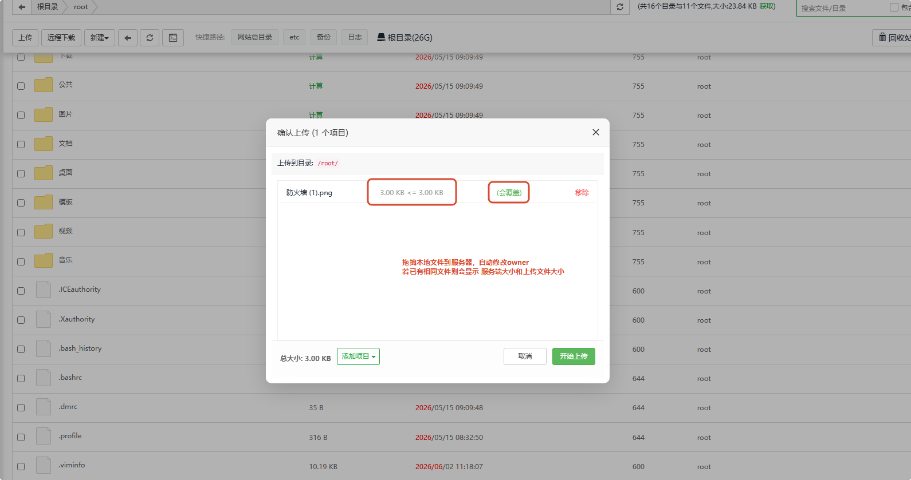

#### 特性四：Linux 文件权限（403 Forbidden 故障排除）

这是零基础新手最常遇到的问题：**上传了网页文件，网页打开却提示“403 Forbidden（禁止访问）”**。

- _原因_：Linux 系统对文件安全非常严苛。每一个文件都有它的“所有者”和“读取权限”。Nginx/OpenResty 的运行用户通常是 `www`。如果您上传的文件所有者不是 `www`，或者权限不够，Nginx 就无法读取这个文件，就会报 403 错误。

- _解决方法_：
  1. 在文件管理器中，勾选您的网站根目录下的所有文件。
  
  2. 点击上方的【权限】按钮。
  
  3. 将“所有者”修改为 `www`。
  
  4. 将“权限值”修改为目录 `755`，文件 `644`。
  
  5. 勾选【应用到子目录】，点击确定。网站即可恢复正常访问。
  
     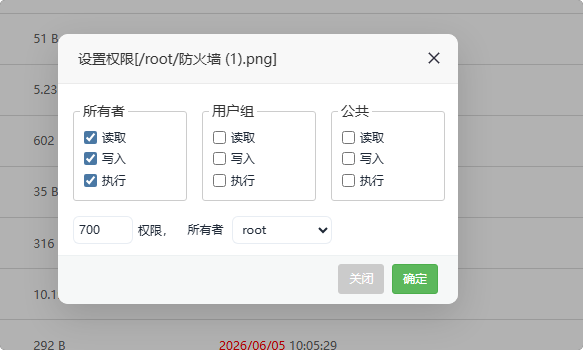

#### 特性五：内置高级代码编辑器与注释快捷键

当您在文件管理器中双击打开任意代码或配置文件（如网站脚本、计划任务等）时，御风面板提供了轻量但功能强大的代码编辑器：

- **核心渲染库升级**：编辑器底层核心组件全面升级至 **CodeMirror 5.65.16** 版本，彻底修复了原先在特定系统环境下打开 Markdown（如 `task.md`）或特定语法文件时控制台报错 `t.lookAhead is not a function` 从而导致编辑器白屏或按钮失效的问题。
- **高级语法高亮**：增加了对 `py` (Python)、`sh/bash` (Shell脚本)、`ini` (配置文件)、`yaml` (数据配置) 以及 `md` (Markdown) 等高频文件的精细化颜色高亮展示。
- **快捷键支持**：内置了与标准桌面开发环境一致的注释快捷键，方便您在网页端直接一键添加或取消代码注释，大幅提升线上脚本微调和调试的便利性。
  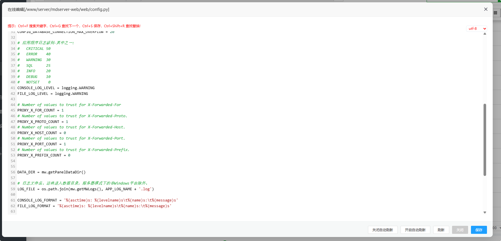

### 4.3 计划任务 (Crontab) —— 让服务器定时自动干活

对于完全没有网络运维基础的用户来说，**计划任务**就像是您在服务器里设定的**智能自动闹钟**。它的唯一目的就是让服务器在特定时间，自动去执行某些繁琐的工作，比如每天凌晨备份网站、每小时清理系统临时垃圾、每天检查服务器的健康状况等。

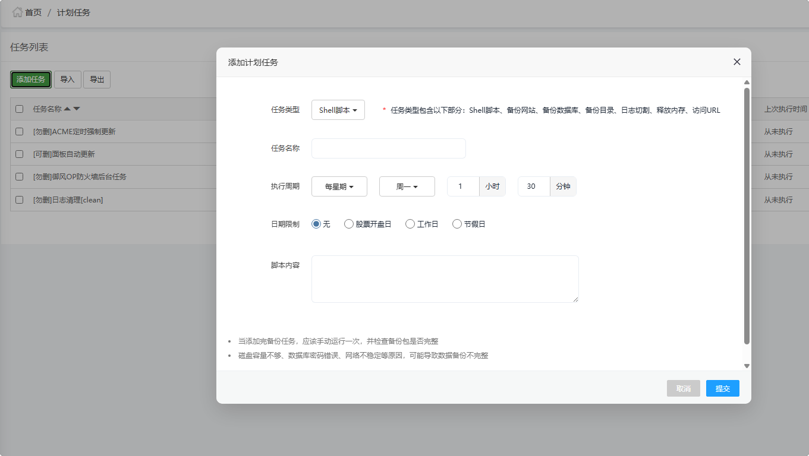

#### 步骤一：如何新建一个定时自动任务

1. 点击左侧导航的“计划任务”。
2. **任务类型**：
   - **Shell脚本**：如果您懂一些命令，可以直接让服务器定期跑一段指令。
   - **备份网站**：最常用的功能。系统会自动打包您指定的网站，并将其保存到 `/www/backup` 目录下，确保数据安全。
   - **备份数据库**：定期打包您的 MySQL 数据。即使服务器遭遇黑客勒索或坏硬盘，有备份就能瞬间恢复。
   - **释放内存**：定时清理系统缓存，建议每周运行一次。
3. **执行周期**：可以选择“每隔几分钟”、“每天固定时间”、“每周的周几”或“每月的几号”。对于大部分备份任务，建议选择**每天凌晨 2:00 - 5:00** 之间运行，因为这个时间网站基本没人访问，服务器最闲。

#### 步骤二：独创的“智能排程策略”（避开节假日与股票交易日）

在传统的控制面板中，定时任务是死板的。例如，设置“每天早上 9 点运行”，它就真的每天都运行。但这给很多金融和企业办公用户带来了麻烦：他们希望只在“股票开盘日”或“法定工作日”才让服务器去抓取数据或发送汇报邮件。
御风面板在此进行了深度重构，独创了**智能排程策略**：

- **云端策略过滤**：在添加任务时，您可以勾选“股票开盘日”或“工作日限制”。
- **运行原理**：任务被触发时，面板不会盲目直接执行，而是会自动请求云端服务器获取当天的日期属性。如果是周六、周日、或者是国庆/春节等法定假期，面板会**智能忽略本次执行**，从而避免在非工作时间产生无意义的计算与告警。

#### 步骤三：备份数据的导入与导出（JSON一键迁移）

当您因为服务器升级而需要更换新主机时，重新一个个去添加几十个复杂的计划任务是一项痛苦的体力劳动。

- **导出任务**：御风面板支持一键将当前所有的计划任务打包成一个标准的 `JSON` 配置文件并下载到本地电脑上。
- **导入任务**：在新服务器安装完御风面板后，只需在计划任务页面点击【导入配置】，选择该 JSON 文件，所有计划任务就会瞬间完璧归赵，彻底实现零损耗迁移。

#### 步骤四：智能日志追踪

当计划任务执行完毕，您怎么知道它到底成功了没有？

- **自动弹出日志**：在手动点击“执行”按钮后，面板会自动弹出一个黑色的日志终端框。
- **5秒无感自动刷新**：如果备份的文件很大，日志框会每隔 5 秒钟无感刷新，并向下滚动，展示最新的备份进度。
- **友好空日志**：如果该任务从未执行过，系统不会显示一堆难懂的代码报错，而是会展示友好的“暂无执行记录”提示，极大优化了新手的阅读体验。

### 4.4 安全与防火墙 (Firewall) —— 服务器的安全大门

如果说您的服务器是一栋大楼，那么**端口**就是这栋大楼的窗户，而**防火墙**就是大楼的大门守卫。
很多初学者常犯的致命错误，就是为了图方便把所有端口全部无锁暴露（比如阿里云安全组放行 `1-65535`），这相当于敞开大楼所有窗户，极易引来黑客和扫描器的轮番轰炸。

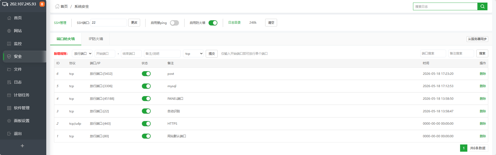

#### 步骤一：常用端口放行与屏蔽操作

网络服务依靠端口对外通讯。作为新手，您只需要记住以下几个高频端口的用途：

- `80` 端口：传统的网页服务（HTTP）通道。
- `443` 端口：安全加密的网页服务（HTTPS）通道。
- `22` 端口：远程登录服务器（SSH）的通道。
- `3306` 端口：MySQL 数据库的外部连接通道。
- _操作指引_：在面板“安全”页面，您可以输入端口号（如 `3306`），填写备注（如“本地连接数据库”），点击放行。一旦不用，随时点击右侧的【删除】即可关闭该通道。

#### 步骤二：防暴力破解（智能 IP 自动封禁）

黑客会使用自动化的扫描脚本，7×24 小时不间断地猜测您服务器的安全账号和密码。

- **IP 自动防卫机制**：御风面板内置了智能防护引擎。当检测到某个网络 IP 连续多次（默认 5 次）尝试登录您的面板或 SSH 并且都失败时，面板会断定该 IP 为恶意攻击者。
- **内核层物理封禁与归属地审计**：面板将直接调用 Linux 底层内核级防火墙（`iptables`），将该 IP 永久拉入黑名单。该 IP 连面板的登录页面都无法再加载出来，从物理层面彻底阻断了黑客的破解行为。您可以在“IP黑名单”列表中随时查看并手动解封误伤的 IP。同时，封禁列表中集成了 MaxMind GeoIP 地理信息库，可以直观呈现每一个被封禁 IP 的地理归属地。

#### 步骤三：底层防穿越与防串站加固

为了防御网络中常见的黑客攻击，御风面板默认开启了高强度的防御措施：

1. **路径防遍历**：限制面板及站点的访问权限，防止黑客通过特殊代码读取系统核心文件（如 `/etc/passwd` 等密码文件）。
2. **CSRF 防护**：防止恶意网站利用您的浏览器缓存伪造请求修改您的面板设置。
3. **Let's Encrypt 证书验证通道平滑放行**：系统防火墙及 WAF 默认对所有站点的 `/.well-known/` 目录进行自动放行。这一机制能够规避因安全策略导致外部验证节点无法访问而造成的 ACME / Let's Encrypt SSL 证书申请与自动续期失败。
4. **WAF 蜜罐全域诱饵阻断**：Web 应用防火墙的蜜罐防护引入全域目录关键字匹配技术。一旦恶意扫描工具或渗透脚本在网站任意深度的物理目录下触及受控关键字，WAF 会瞬间锁定客户端指纹，并自动执行 iptables 物理级隔离。

### 4.5 软件商店与插件管理器 (Soft)

御风面板之所以非常轻量快捷，是因为它采用了**按需安装的“插件化架构”**。新面板就像一张白纸，您需要什么网站环境，就去软件商店里装什么，没有一丝多余的后台进程。

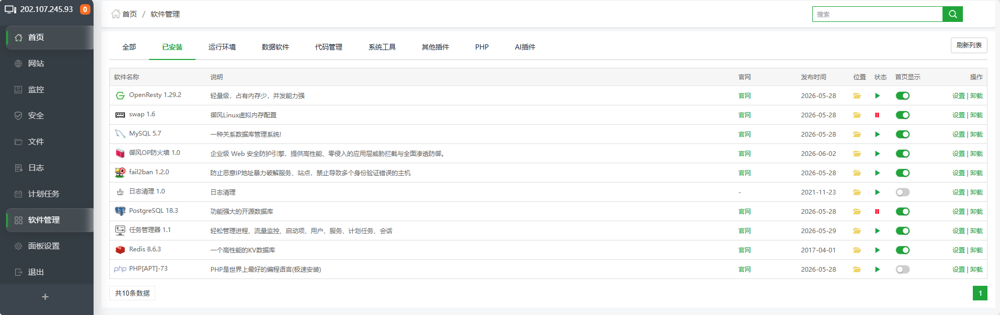

#### 步骤一：软件的后台编译安装（mw-task 队列）

1. 在软件商店中找到您需要的软件（如 php8.3），点击右侧的【安装】。
2. **静默排队编译**：点击安装后，页面上不会出现长时间的“转圈卡死”，您可以继续去修改网站或管理文件。
3. 面板会把安装命令自动投递给后台的守护进程任务队列（`mw-task`）。它会根据您服务器的 CPU 核心数，以最优的系统资源优先级在后台下载、编译并安装软件。
4. 您可以在面板右上角点击“任务列表”，随时查看当前的编译进度日志。

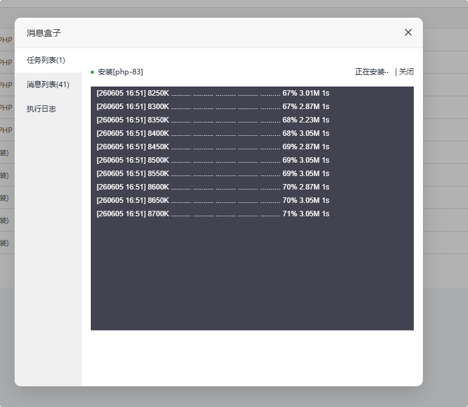

#### 步骤二：新手核心环境安装推荐

对于一个标准的建站用户，建议您在软件商店中安装以下三个“黄金组合”：

1. **OpenResty**（必装）：负责接收用户的网页访问请求，扮演“网站店小二”的角色。
2. **MySQL**（选装）：如果您的网站是 WordPress 或需要保存用户账号数据，必须安装此数据库。
3. **PHP**（选装）：网页如果由 PHP 语言编写，必须安装。推荐安装 **PHP 8.0**。

#### 步骤三：高级安全加固插件（以 Web应用防火墙 WAF 为例）

如果您的网站对安全要求极高（比如企业官网或电商系统），我们提供了内置的 Web 防火墙（御风OP防火墙）：

- **一键拦截漏洞**：WAF 可以在网站的第一道防线，自动拦截各种针对网站代码漏洞的“SQL注入攻击”和“XSS跨站脚本攻击”。

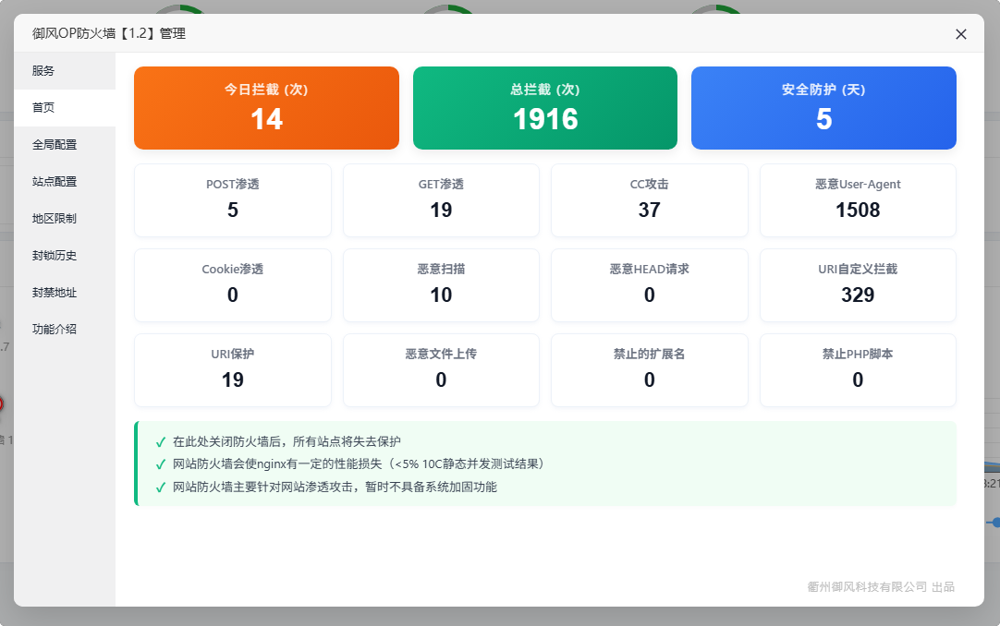

- **防恶意扫描**：自动识别黑客用来寻找网站后台的扫描器，直接返回 403 错误或将其 IP 封锁，让您的网站稳如磐石。

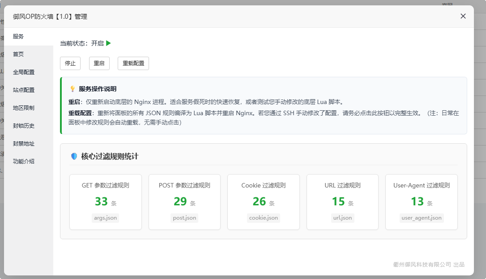

#### 步骤四：软件缓存清理与防误删双重保险

- **清理缓存**：长时间安装多个软件后，服务器可能会残留大量的源码下载包。您可以点击右上角的设置齿轮图标，选择【清理缓存】，一键释放被占用的磁盘空间。
- **防误删与无缝备份**：如果需要卸载某个数据库或核心插件，面板会强制要求您手动输入插件名称进行**二次确认**。更贴心的是，在您点击确认卸载前，系统会**默认自动将您的插件数据打包备份**到 `/www/backup` 目录下，彻底杜绝手误导致的业务数据毁灭；卸载时面板还会安全保留该插件控制器，防止其从列表中消失。

#### 步骤五：Docker 等环境安装国内镜像自适应机制

由于国内服务器下载 Docker 引擎和第三方 Python 依赖库时经常会遭遇网络限流或连接重置导致安装卡死的问题，御风面板的软件商店安装脚本在底层全面适配了中国区镜像加速：
- **Docker 自动镜像换源**：在安装 Docker 插件时，系统如果检测到是在国内服务器运行，会自动将 Docker 的软件安装源重置为国内主流阿里/清华镜像源，并引入自动重试容灾机制，完美规避 Docker 无法启动及由于 “Recv failure: Connection reset by peer” 导致的安装报错与假死问题。

## 第五部分：系统监控与性能调优

任何服务器，在长期运行过程中都有可能因为访问量暴增、网页代码有死循环，或者是某些后台程序内存泄漏而导致“卡死”。**系统监控**就是服务器的“心电图”，让您能够随时掌握其健康状态。

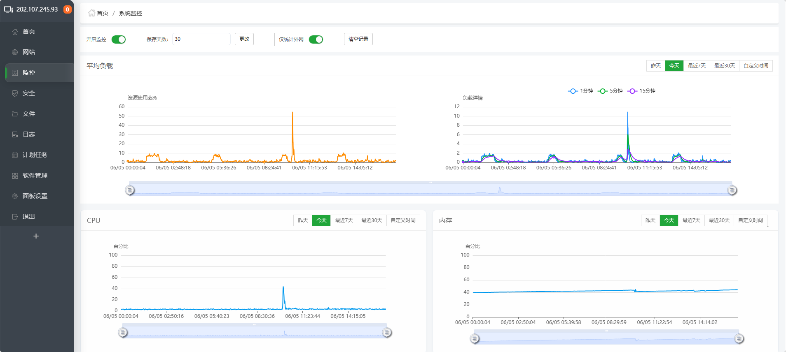

### 5.1 监控图表指标全科普（新手必读）

点击左侧“监控”菜单，您会看到几组波动的折线图，这代表了服务器历史运行的负荷：

1. **CPU 使用率**：
   - _概念_：CPU 是服务器的大脑。使用率如果长期高于 **80%**，说明服务器正在超负荷运转，您的网站访问起来可能会变得非常缓慢。
   - _底层重构亮点_：在老旧版本中，获取 CPU 使用率会阻塞后台进程整整 1.0 秒，导致面板响应十分卡顿。御风面板经过深度重构，利用“总 CPU 使用率恒等于各核心使用率的算术平均值”原理，消除冗余计算，将 API 响应提速 10 倍以上，实现了零阻塞高频无感监控。
2. **内存与 Swap（交换分区）**：
   - _物理内存（RAM）_：服务器运行程序时临时存放数据的空间。如果内存满了，系统会自动强制关闭一些程序（比如把您的 MySQL 数据库直接杀掉）。
   - _Swap 交换分区_：这是一种**兜底机制**。它是把服务器硬盘的一部分虚拟成内存来使用。当物理内存快满时，系统会把不常用的数据挪到 Swap 中，防止软件因内存不足而直接崩溃。作为新手，如果发现物理内存快满了，但 Swap 还有很多空闲，您的服务器依然是安全的。
   
   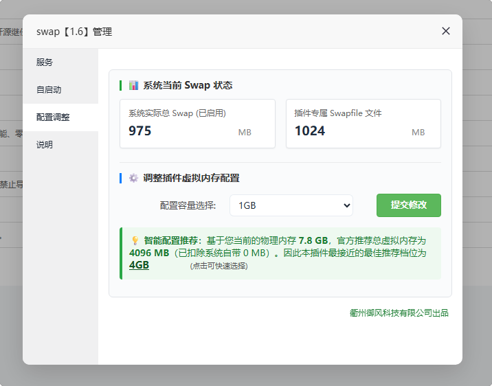
3. **网络流量（网卡流量）**：
   - _流量流入（Rx）_：外部世界向您的服务器发送的数据大小（比如用户上传文件，或者黑客对您进行流量攻击）。
   - _流量流出（Tx）_：您的服务器向外发送的数据大小（比如用户在下载您网站里的图片、看您的网页视频）。
   - _网卡 O(1) 性能优化_：在多网卡或容器（Docker）复杂环境下，传统监控会因为频繁读取网卡信息而产生极高的资源消耗。御风面板将相关数据拉取优化为 $O(1)$ 常数开销，完全排除了因监控本身造成的系统卡顿。

---

## 第六部分：进阶与高级运维技巧

当您对面板的基础操作有了一定了解后，掌握一些高级操作与自救常识，能让您在面对突发故障时像专业运维人员一样从容应对。

### 6.1 命令行管理工具（bs）参数大详解

虽然御风面板主打网页可视化操作，但如果遇到网络故障导致网页彻底打不开，您依然可以通过 SSH 终端，使用极其方便的命令行工具 `bs` 进行紧急管理。

请连接 SSH 后，直接输入 `bs` 回车，即可打开图形化菜单。或者您可以直接运行以下高频快捷指令：

- `bs default`：**最常用指令**。如果您忘记了面板的登录端口、安全入口，或者忘记了管理员初始密码，运行此命令可以在屏幕上直接打印出所有登录信息。
- `bs restart`：如果您修改了系统配置导致面板卡死，运行此命令可以强制重启面板所有后台服务。
- `bs stop` / `bs start`：停止或启动面板服务。
- `bs update`：在线拉取御风面板的最新安全修复补丁与新功能。
- `bs clean`：一键清理服务器中积累的各种系统临时缓存、冗余日志，快速释放被占满的硬盘空间。
- `bs 9`：**应急强杀自愈指令**。在遇到极端高负载或未知异常导致面板完全卡死无响应时，执行此命令将直接向后台守护进程投递强制退出信号，瞬间物理释放死锁资源并重新拉起纯净面板服务。

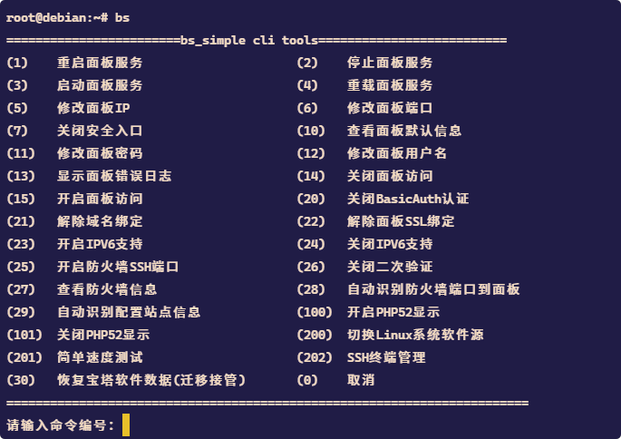

### 6.2 极端网络下的 Fallback 本地静态资源兜底机制

很多传统的服务器面板有一个致命弱点：它们的前端界面极其依赖公共网络上的 CDN 静态加速节点（如 jQuery、Bootstrap 库等）。如果这些 CDN 节点在中国区被阻断、或者您的服务器处于完全离线、局域网的内网环境中，登录面板时网页就会因为静态资源加载失败而呈现一片空白，无法操作。

为了彻底消除这一隐患，御风面板全新开发了**零延迟静态 Fallback 兜底机制**：

- **双重智能校验**：面板在加载第三方 CSS 和 JS 资源时，内置了 `onerror` 容错监听。
- **毫秒级自动切换**：一旦检测到公网 CDN 加速节点在几十毫秒内无法响应，面板前端会在网页背景中**自动且毫无痕迹地**将资源请求重定向回您服务器本地的静态文件库（`/web/static`）。
- **带来的优势**：兼顾了公网环境下的秒开，并保证了 100% 离线、局域网或断网调试环境下的完美可用性。

### 6.3 灾备机制与手动全量物理备份

为了保证服务器在遇到天灾人祸（比如云厂商机房着火、固态硬盘损坏、或者中了木马病毒）时，您的网站数据不丢失，建议您定期执行手动全量打包备份。

#### 一键打包备份命令：

请在 SSH 终端运行以下命令，将御风面板的所有数据库、系统配置与核心配置数据打包：

```bash
tar -czf /www/backup/bt_simple_data_$(date +%Y%m%d).tar.gz /www/server/mdserver-web/data
```

该命令会在 `/www/backup` 目录下生成一个以当天日期命名的压缩包。**请把这个压缩包下载并保存到您自己的个人电脑或网盘中。**

### 6.4 应急一键回滚还原

如果您在从宝塔面板或老版 mdserver-web 迁移过来后，因为系统底层兼容性问题（比如某些极其古老的 Linux 内核不支持新特性），导致您的网站无法正常拉起，不需要慌张。御风面板为您准备了“后悔药”——一键回滚指令。

在 SSH 终端中执行对应的指令，即可瞬间将服务器还原：

- **退回原本的老版本 mdserver-web 状态**：
  ```bash
  bash deploy.sh rollback_mw
  ```
- **退回原本的老版本宝塔面板（BT.CN）状态**：
  ```bash
  bash deploy.sh rollback_bt
  ```

系统会重新拉起您迁移前的环境，并将物理隔离备份的旧数据库等数据原样放回，确保您的业务在最快时间内重回轨道。

---

## 第七部分：高频核心软件与安全插件配置指南

本章将为您手把手拆解面板中最重要的几款核心软件（OpenResty、MySQL、PHP）以及四大安全/系统管理插件（御风OP防火墙、御风进程守护、Swap虚拟内存、Fail2ban暴力防破解）的安装、配置和实际使用方法。

---

### 7.1 Web 服务器：OpenResty

**OpenResty** 是基于 Nginx 的高性能 Web 服务器，也是整个面板运行网站的最底层支柱。它负责解析用户的 HTTP/HTTPS 请求，并将网页内容呈递给浏览器。

#### 1. 安装方法

- 在左侧导航点击“软件商店”。
- 在软件列表中找到 `OpenResty`，点击右侧的“安装”。
- 安装任务会推入后台的 `mw-task` 队列。在此期间，您可以去操作面板的其他功能，无需停留在当前页面。

#### 2. 核心配置说明

- **配置文件管理**：点击 OpenResty 的“设置”按钮，可以在“配置文件”选项卡中看到 `nginx.conf`。它是全局 Web 服务器的控制中心。
- _新手警示_：一般情况下不建议直接修改全局配置文件。每个新建网站的独立配置文件（Vhost）会自动存放在 `/www/server/web_conf/nginx/vhost/` 目录下，相互独立隔离。
- **连接数限制（Keepalive）**：默认配置已优化。对于小内存服务器，保持默认即可；若网站访问人数极多，可在配置文件中适当调大 `worker_connections` 值。

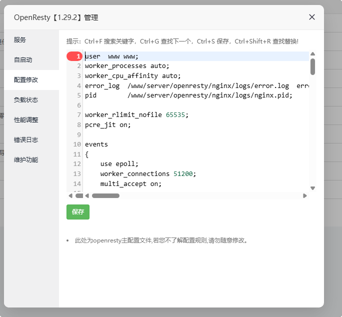

#### 3. 常见使用与故障排查

- **服务控制**：在 OpenResty 设置弹窗中，支持启动、停止、重启以及“重载配置”。修改网站配置（如反代、伪静态）后，点击“重载配置”即可平滑生效，不会中断已有用户的访问。
- **排查 502 Bad Gateway 错误**：如果是动态网站（如 WordPress）访问报错 502，通常不是 OpenResty 坏了，而是它身后的 **PHP 服务崩溃**或没有启动。“店小二”接收了请求，但找不到负责干活的 PHP 解释器。此时请去检查 PHP 服务状态。

---

### 7.2 关系型数据库：MySQL

**MySQL** 是一款经典的关系型数据库管理系统。大部分动态网站（如博客、商城、论坛）的用户名、密码、文章、订单等数据，都存放在 MySQL 中。

#### 1. 安装方法

- 在软件商店中找到 `MySQL`，推荐选择最稳定的 **MySQL 5.7** 版本进行一键后台编译安装。

#### 2. 核心配置与安全加固

- **重置 Root 密码（必做）**：
  - MySQL 安装完成后，默认会生成一个临时的随机密码。请务必在“软件商店” -> MySQL 设置中，找到“修改密码”功能，将其修改为您专用的超高强度数据库根密码（Root 密码）。
- **默认关闭 X Protocol 协议**：出于网络与端口安全的极致考量，御风面板的 MySQL 插件默认关闭了 MySQL 默认启用的 X 协议（不占用 `33060` 端口），消除了不必要的潜在外部扫描与端口攻击暴露面。
- **库名校验防误删**：在数据库列表点击“删除”特定数据库时，系统除了弹出警告框外，还强制要求您手动输入该数据库的**完整名称**进行比对。输入有误则无法点击确定，从而彻底封堵手滑误删库的悲剧。
- **卸载数据打包自动归档**：在对数据库执行卸载操作时，面板除引入“名称二次验证”外，会自动在后台触发物理打包机制，将当前的数据库底层文件整体备份并归档至 `/www/backup`。即使误点击卸载，也能保障生产数据不丢失。
- **配置文件修改（my.cnf）**：
  - 可以通过设置界面直接编辑 `my.cnf` 文件。
  - _优化提示_：对于低内存服务器（如 1G 内存），可以在配置文件中找到 `key_buffer_size` 和 `query_cache_size` 参数，并根据系统状态提示适当缩小其大小，以防 MySQL 占用过多内存被系统强制关闭。
- **禁止外网直连连接**：出于安全考虑，默认情况下 MySQL 的 `3306` 端口不会向公网开放，仅允许本地（`127.0.0.1`）访问，避免黑客通过网络爆破数据库密码。

#### 3. 数据库的日常使用

- **新建数据库**：点击左侧“数据库”菜单，可以一键创建数据库名、指定专用的数据库用户名和强密码。
- **备份与还原**：在数据库列表右侧，点击【备份】即可瞬间生成一个 `.sql` 备份压缩文件。建议结合“计划任务”每日凌晨自动打包备份。

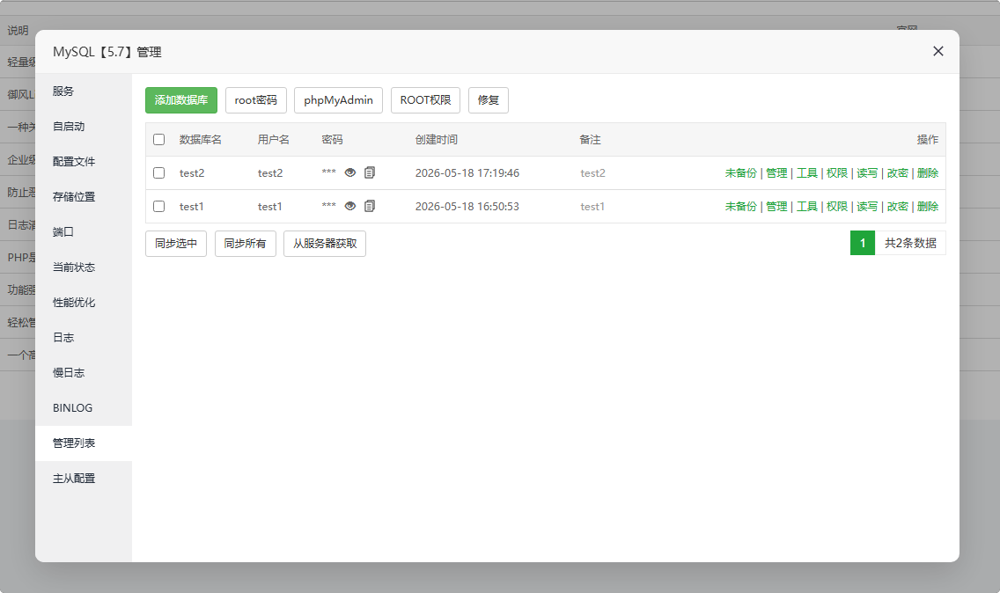

---

### 7.3 脚本解释器：PHP 及其扩展

**PHP** 是一种通用的开源脚本语言。如果您的网站是由 PHP 编写的（如 WordPress），服务器需要安装 PHP 解释器才能看懂并执行网页的代码。御风面板的一大优势是支持**多版本 PHP 共存**。

#### 1. 安装方法

- 在软件商店中，您可以根据网站程序的要求，安装 **PHP 7.4** 或是最新的 **PHP 8.0/8.1**。

#### 2. php.ini 核心参数调整（手把手教学）

点击 PHP 的设置，在“配置文件”或“常规设置”中，有三个新手必须知道并调整的参数：

1. `upload_max_filesize`（最大上传文件大小）：
   - _默认值_：通常为 2M 或 50M。如果您的网站需要上传大视频或大附件，请将其修改为比如 `100M` 或 `500M`。
2. `memory_limit`（PHP 脚本内存限制）：
   - 限制单个 PHP 网页执行时最多能吃掉多少内存。通常设置为 `128M` 或 `256M`。
3. `max_execution_time`（最大执行超时时间）：
   - 防止有死循环代码把服务器卡死。默认为 30 秒或 60 秒。如果网站在导入大量数据时频繁提示“Time Out”，可以临时将其调大至 `300`。

#### 3. PHP 扩展一键安装

有些网站程序会提示“缺少 Redis 扩展”或“缺少 opcache 模块”。在 PHP 设置的“扩展管理”选项卡中，您只需找到对应的名称（如 `redis` 或 `opcache` 加速器），点击一键安装即可。系统会在后台全自动完成下载与配置挂载。

#### 4. 常见使用与故障排查（含一键强杀进程自愈）

- **服务重启与重载**：在 PHP 管理器的主界面，您可以对当前运行的 PHP-FPM 进行启动、停止、重启或重载配置操作。
- **一键强杀 PHP 进程**：如果您的网站因死循环代码、恶意扫描、或者并发流量暴增，导致 CPU 占用率瞬间飙升至 100%，且普通的“重启”按钮由于服务卡死而无法响应时，您可以点击 PHP 管理器右上角的“**强杀进程**”按钮。系统将直接向底层对应的 PHP-FPM 进程投递 SIGKILL 强杀信号，瞬间释放被锁死的系统资源，并自动拉起干净的 PHP 进程，实现秒级故障自愈。

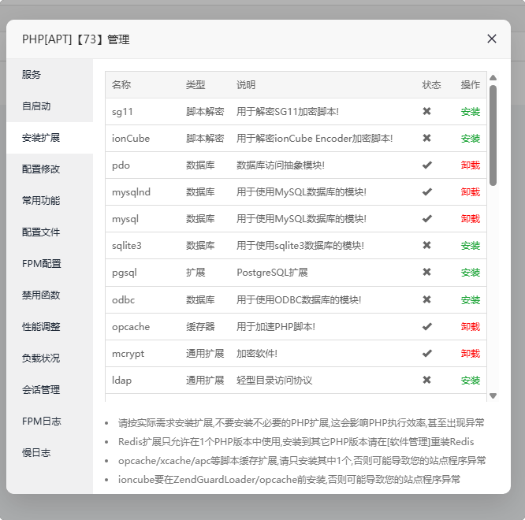

---

### 7.4 企业级应用安全拦截：御风OP防火墙 (op_waf)

**御风OP防火墙** 是一款运行在应用层（Web层）的高性能 Web 应用防火墙（WAF）。它直接嵌入在 OpenResty 的 Lua 执行链中。所有访问您网站的流量都会先被它过滤，发现黑客攻击行为则直接予以物理拦截。

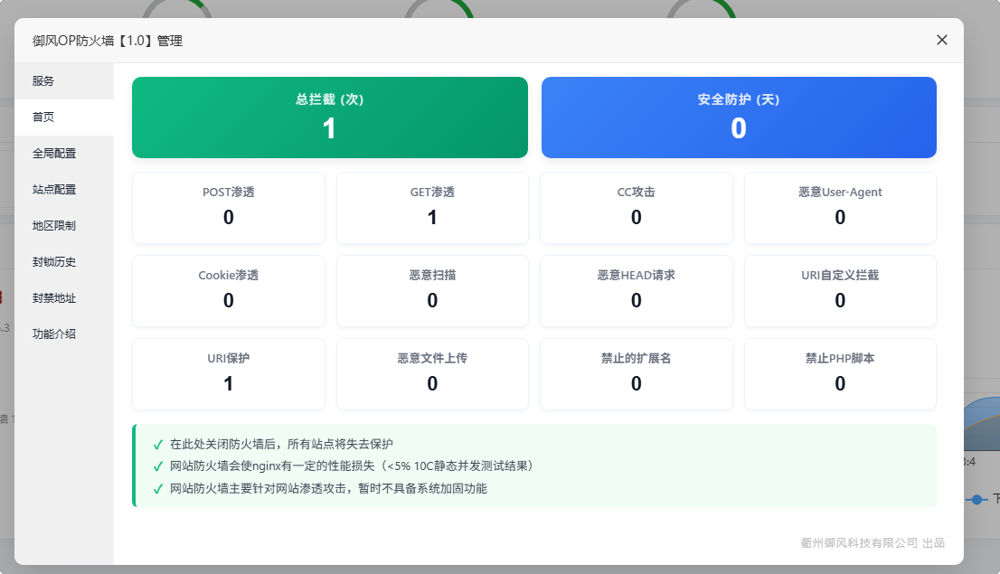

#### 1. 安装与挂载

- 在软件商店找到“御风OP防火墙”，点击一键安装。
- 安装后，系统会自动在 OpenResty 的全局加载入口中，挂载 `waf_init_preload.lua`、`opwaf_init.lua` 等安全过滤模块。

#### 2. 防护配置与规则管理

点击 OP防火墙的设置面板：

- **站点防护开关**：您可以精确控制哪个站点需要开启防火墙，哪个站点需要临时关闭。
- **规则库自定义**：WAF 预置了丰富的过滤规则。您可以点击修改各种攻击过滤阈值：
  - **SQL注入防御**：拦截攻击者尝试读取您数据库敏感信息的指令。
  - **XSS跨站脚本防御**：拦截在网页中插入恶意广告或窃取他人 Cookie 的脚本。
  - **CC防护（防恶意刷新）**：当单个 IP 访问频率暴增（例如 1 秒内请求了 100 次同一个页面），WAF 会判定其在进行 CC 刷流量，直接返回“验证码”或将该 IP 临时拉黑。
  - **Cookie 防御与 UA 拦截**：防止恶意爬虫和扫描器对您的网站进行全盘扫描。
  
  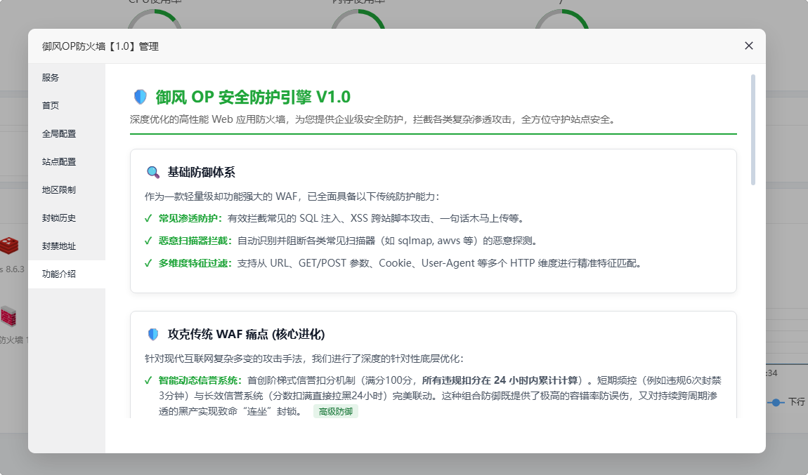
- **IP 段 CIDR 拦截**：如果某个特定的 IP 范围（如某个恶意的云厂商机房段）频繁攻击您的网站，您可以直接以 `192.168.1.0/24` 的 CIDR 格式添加黑名单，一键封锁整段 IP。
  - **WAF 蜜罐防护与 Decoy（诱饵）阻断**：全新支持防火墙蜜罐技术。在站点隐藏入口部署“虚拟漏洞蜜点”，一旦扫描器尝试踩雷探测，系统能自动锁定其恶意行为、追踪工具指纹并予以封禁。
  - **浏览器指纹识别 (Browser Fingerprinting)**：多维度校验访问客户端的浏览器属性（包括渲染特性、无头浏览器标识等），从底层彻底拦截高级自动化爆破及 CC 攻击脚本。
  - **JSON/API 专属防御引擎**：专门针对现代前后端分离及微服务架构的 JSON / API 接口定制防护规则，防范针对 API 数据的特殊字符篡改与越权注入。
  - **404 恶意扫描行为分析**：黑客攻击前常会暴力遍历网站敏感目录。WAF 会实时跟踪客户端请求触发 404 状态码的频率。一旦在短时间内连续请求多个不存在的路径，系统会直接将其拉黑。
  - **IP 匹配性能优化 (lua-resty-ipmatcher)**：底层引入了高性能的 IP 比对算法。在面临几十万级别恶意 IP 段封锁时，可实现毫秒级的快速匹配与秒级阻断，彻底解决海量规则导致的网站响应延时。
  - **Trusted Proxy 真实 IP 透传识别**：当您的网站处于 CDN、高防或负载均衡后端时，WAF 依然能够穿透代理节点，获取最终真实客户端 IP 并基于该 IP 执行频率限制与封锁。
  - **路径上传控制、安全签名检测与环回口安全加强**：深度对上传文件的大小、格式进行精细化拦截，加固系统本地回环网络请求的认证安全性。
    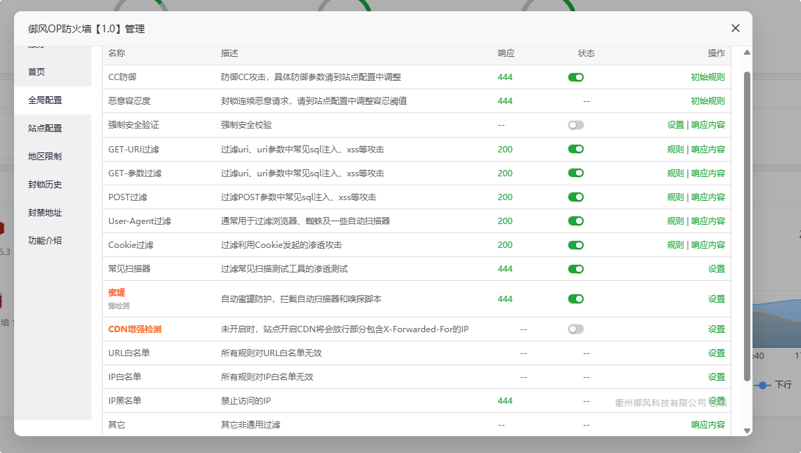

#### 3. 运行统计与日志审计

- **SQLite 高性能日志存储**：所有的攻击拦截数据，都会被整理记录到 `/server/op_waf/logs/waf.db` 中。
- **可视化图表**：面板支持直接查看当天拦截了多少次攻击、攻击者的 IP 来自哪个国家（集成 MaxMind GeoIP 地理库），让您对网站的安全状况成竹在胸。

#### 4. 简单自测

在浏览器输入模拟渗透地址

```
http://xxx.xxx.com/?id=1+union+select+1,2,3
```


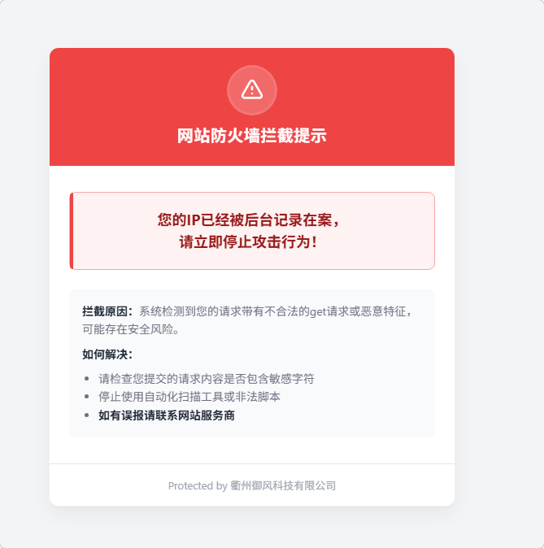

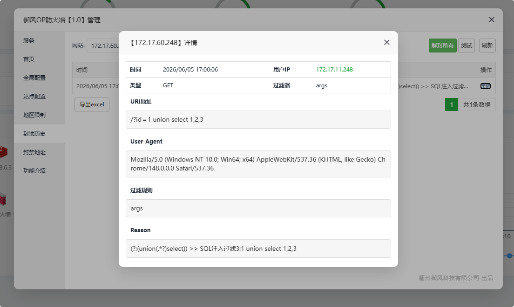

---

### 7.5 轻量级应用进程哨兵：御风进程守护 (yufeng_systemd)

在服务器上，有些您自己运行的程序（例如 Python 爬虫脚本、Node.js 服务、AI 引擎等）经常会因为意外报错退出。如果每次都需要人工去重新启动，运维压力极大。
**御风进程守护** 利用 Linux 底层的 Systemd 服务控制，为您提供了一个能“24小时不知疲倦盯着程序、倒了就扶起来”的哨兵工具。

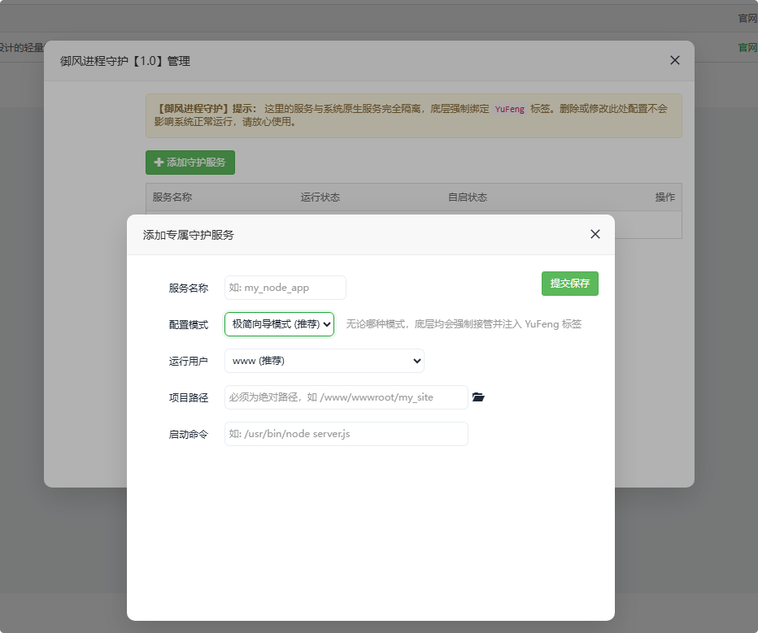

#### 1. 安全隔离设计

御风进程守护在创建任何进程服务时，都会在底层的配置文件中强制绑定 `Documentation=tag:YuFeng` 标识标签。

- _有什么用_：这相当于给受托管的进程发了一张“特许通行证”。面板只允许读取和操作带有该标签的进程服务，完全杜绝了越权操作服务器其他核心系统服务的安全隐患。

#### 2. 智能双模配置（手把手新建守护）

点击插件“添加守护进程”，支持两种模式：

- **Simple（简易）模式（推荐新手）**：
  1. **服务名称**：仅限字母、数字和中划线（如 `my-web-app`）。
  2. **运行用户**：为了安全，建议选择非 root 用户，默认使用 `www`。
  3. **工作目录**：填写您程序文件所在的绝对路径（必须以 `/` 开头，如 `/www/wwwroot/app`）。
  4. **启动命令**：您平时手动启动该程序的命令（如 `python3 main.py` 或 `node server.js`）。
  5. 点击确定。系统会自动在 `/etc/systemd/system/` 下创建服务文件，并强制配置 `Restart=always`（挂掉则无限重启）和 `RestartSec=5`（挂掉后等5秒自动拉起）。
- **Custom（自定义）模式**：
  - 如果您是高级技术人员，可以直接在文本框内贴入您写好的 Systemd 原始配置文件内容。插件会自动过滤并在 Unit 节点中智能注入 `Documentation=tag:YuFeng` 隔离标签。

#### 3. 服务控制与日志追踪

- **服务控制**：在守护进程列表中，您可以像控制普通服务一样，一键对该进程进行【启动】、【停止】和【重启】。删除服务前，系统会提醒您先停止该进程，以防产生残留僵尸进程。
- **实时日志查阅**：插件后台会自动运行 `journalctl -u 服务名.service -n 100 --no-pager`。您只需点击【日志】按钮，就能在网页上直观看到该程序打印出的最后 100 行控制台报错或输出信息，极大简化了程序的调试过程。

---

### 7.6 物理虚拟内存配置：Swap

当服务器物理内存（RAM）不足时，系统会直接变得卡顿，甚至因为 OOM（内存溢出）机制而直接关停您的 MySQL 等重要软件。
**Swap** 插件是一剂应急强心针。它允许您把硬盘的一部分空间开辟为虚拟内存，在物理内存快被撑爆时，承接多余的数据。

#### 1. 参数安全强固设计

有些劣质面板的虚拟内存设置没有防范任意命令注入攻击。而御风面板的 Swap 插件进行了严格的重构：

- **正整数校验**：输入的值必须为纯正整数。
- **范围强锁**：容量大小强制限制在 **100MB 至 32GB** 之间。任何超出这一安全范围或者带有恶意代码的输入都会被系统拒绝，彻底消除了命令注入的高危漏洞。

#### 2. 挂载与使用步骤

1. 在软件商店找到“swap”，点击一键安装。
2. 进入设置，输入需要新增的虚拟内存大小。
   - _新手分配法则_：如果您的服务器物理内存是 1G，建议 Swap 设置为 `1024M` 或 `2048M`；如果物理内存是 2G 且硬盘空间充裕，建议设置为 `2048M` 即可。
3. 点击确定，面板会自动在后台调用 `dd` 命令写入专属的 `swapfile` 文件，自动设置高安全级的 `chmod 600` 文件权限（仅 root 可读写虚拟内存数据），然后调用 `mkswap` 初始化并实现开机自动挂载服务。
4. 在 Swap 设置页面，可以实时横向查看当前系统实际的 `MemTotal`（总物理内存）、`SwapTotal`（总虚拟内存）以及已经挂载的大小。

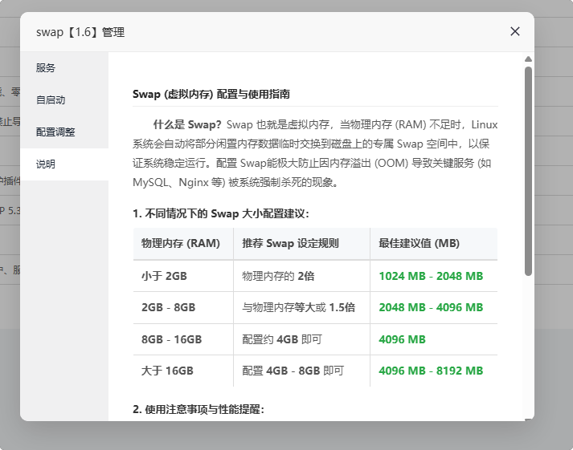

---

### 7.7 服务器防暴力破解盾牌：Fail2ban

**Fail2ban** 是一款极其经典且强悍的防御外部暴力破解的安全工具。它通过后台监控系统的登录日志（如 `/var/log/auth.log` 或 `/var/log/secure`），自动揪出那些一直在尝试猜测密码的恶意 IP。

#### 1. 安装与机制

- 在软件商店找到 `fail2ban` 并点击安装。
- 安装后，Fail2ban 会在后台启动为一个 Systemd 服务。
- **初始化配置模板**：安装过程中，面板会自动将精心优化的 `/etc/fail2ban/jail.d/default.conf` 默认监控规则进行替换覆盖，并自动挂载相应的 SSH 等默认监控“监狱”（Jail）。

#### 2. 运行状态与封禁 IP 审计

点击 Fail2ban 的设置面板：

- **封禁 IP 计数**：可以实时看到当前有多少个恶意 IP 已经被它封锁。
- **监狱状态明细**：会展示出当前启动了哪些监控监狱（如 sshd 监狱）。
- **最后 20 行日志审计**：支持在界面中直接读取 `/var/log/fail2ban.log` 的最新运行动态。您能在这里看到哪些 IP 在几点几分因为尝试破译密码失败，被拉入了黑名单。

#### 3. 手动拉黑与手动放行（黑名单文件配置）

如果您想手动永久禁止某个 IP 访问您的服务器，或者您自己的 IP 因为手抖输错密码被锁死，需要手动解封：

- **设置黑名单**：在“黑名单”选项卡里，可以直接输入 IP 列表。输入支持单 IP 或逗号分隔的 IP 数组。
- **白名单管理**：在配置文件中，您也可以添加您的办公室或家里 IP 到 `ignoreip` 参数中。Fail2ban 将永远不封禁白名单内的 IP。
- _底层原理_：当您在面板添加或清除黑名单时，御风面板会在后台智能调用 `fail2ban-client -vvv set {jail} banip {ip}` 或 `unbanip` 进行即时封锁/解封，同时将配置同步写入 `black_list.json` 做持久化保存。

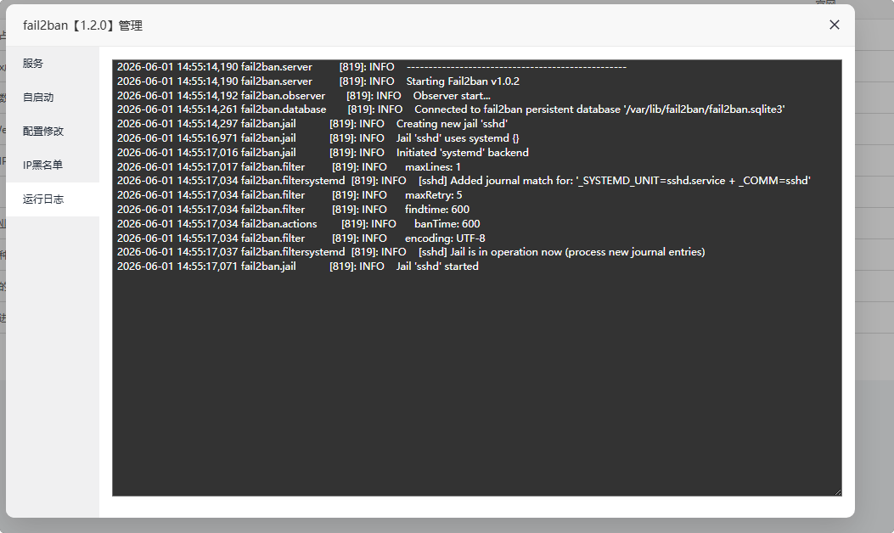

### 7.8 Docker 容器与大模型环境部署

随着各种开源应用（如博客框架、云盘、AI 大模型）的普及，**Docker** 容器化部署变得越来越重要。它就像一个个预装好环境的“集装箱”，您无需配置繁杂的语言依赖，只需拉取镜像即可瞬间跑起一个复杂的系统。

#### 1. 安装方法与底层加固

- 在软件商店找到 `Docker` 插件进行一键安装。
- _安全加固说明_：御风面板的 Docker 插件经过了深度的安全重构，彻底修补了参数拼接导致的命令注入高危漏洞；同时它精准捕获了容器守护进程在拉取失败时的报错（如 `not found` 或 `denied` 等致命错误），彻底杜绝了因网络超时或镜像不存在而导致的“假装安装成功”的错觉。

#### 2. 独创的智能加速器与自动容灾拉取

由于国内网络环境对 Docker 官方源（Docker Hub）经常存在阻断，我们为您量身定制了极为友好的容灾防阻断功能：

- **可视化加速器管理**：点击 Docker 插件的【加速器】，您可以直接在面板内配置类似于阿里云或自建的专属 Docker Mirror 节点，并一键重启服务生效。
- **自动容灾重试拉取**：面板具备智能容灾功能。当您在获取镜像时，如果系统检测到官方服务器拉取超时或无响应，它并不会直接报错退出，而是会**自动启动后备预案，轮询您填写的所有加速器节点进行替代拉取**。这极大程度地保障了在极恶劣网络环境下的应用部署成功率。

---

### 7.9 Java 环境运行插件：JDK 管理

对于运行大型 Java 企业级应用（如 Spring Boot 服务、Tomcat 网站等）的用户，御风面板提供了专门的 **JDK 管理** 插件。

- **多版本云端自动拉取**：JDK 插件控制器经过了深度重写与 Bug 完美修复，支持从官方云端自动抓取并呈现完整的 JDK 运行版本列表（包括 JDK 8, 11, 17, 21 等高频长期支持版本）。
- **一键极速配置**：用户无需繁杂的系统环境变量手动配置（如 `JAVA_HOME` 的声明和 PATH 挂载），在面板中只需点击安装，系统将在后台自动完成编译或二进制包解压，并完成全局环境的挂载，保障 Java 环境开箱即用。

---

### 7.10 缓存服务启动自愈：Redis 进程冲突清理

在高并发缓存软件 **Redis** 的运维过程中，常常会遇到因异常断电、系统非正常重启或宝塔迁移后，系统原有的 Redis 守护进程残留占用 `6379` 物理端口，导致面板在拉起 Redis 服务时频繁报错冲突。

- **端口独占前置清理**：御风面板重构了 Redis 的启动控制逻辑。在正式拉起 Redis 服务前，自愈引擎会自动扫描 `6379` 端口的占用情况。若检测到非受控进程残留，会执行前置物理清理操作，强力清空残留占用，完美避开端口冲突导致的服务无法启动故障，确保缓存系统秒级拉起。
- **宝塔迁移垃圾清理**：在从宝塔迁移 Redis 缓存数据时，自愈逻辑会自动甄别并清理旧面板遗留的多余临时快照和废弃配置文件，保障运行环境的纯净与稳定。

---

## 结语：构建自治、安全且轻量化的 Linux 服务器运维基石

随着云计算与分布式架构的普及，Linux 服务器已成为现代互联网服务不可或缺的底层支柱。然而，传统的服务器管理方式要么受限于繁琐的命令行指令，抬高了普通用户的准入门槛；要么受限于市面上部分商业化面板的冗余功能、后门隐患及强行捆绑策略。

**御风面板（BtSimple）** 的诞生，本质上是对 **Unix 哲学（Keep It Simple, Stupid）** 的一次理性回归与现代演进。通过对整个系统管理流程、性能瓶颈以及安全机制的深度重构，御风面板成功在“使用门槛”与“专业深度”之间建立了一座稳固的桥梁。

### 1. 核心技术优势总结

回顾本说明书所涵盖的所有内容，御风面板的专业性与优越性主要体现在以下三个维度：

- **极致的轻量与零阻塞（Efficiency & Non-blocking）**：
  传统的面板监控和进程管理常常伴随着高昂的磁盘 I/O 和 CPU 阻塞损耗。御风面板通过将菜单管理重构为“运行进程内存缓存”、将多网卡监控提炼为常数时间复杂度 $O(1)$ 计算，并消除 CPU 统计的同步线程挂起，确保了即使在 512MB-1GB 物理内存的极低配置 VPS 上，面板依然能以毫秒级速度响应。
- **多层级纵深安全防卫（Defense-in-Depth）**：
  安全不是单一的防御措施，而是一个完整的防御链条。御风面板通过底层 `bcrypt` 强哈希密码存储机制阻断库泄露风险；通过 fail2ban 内核层 `iptables` 物理隔离机制阻断 SSH 暴力破解；通过基于 Lua 引擎构建的 `op_waf` 零侵入式网关防火墙过滤 SQL 注入与 CC 攻击；配合 `yufeng_systemd` 的 Documentation 标签安全隔离，最终构筑了“网络层 - 内核层 - 应用层”的三维纵深防御基准。
- **无缝兼容与故障自愈（Robustness & Migration）**：
  系统在多变的生产网络环境下必须具备强韧的生存能力。CDN 故障时的前端“零延迟本地双回退机制”确保了局域网及极端弱网下控制台的 100% 可用性；而在面对迁移或不可逆升级故障时，物理路径隔离备份机制与 `rollback_bt` / `rollback_mw` 一键后悔药回滚指令，最大程度地为企业与个人数据安全提供了终极安全阀。

### 2. 面临的责任与未来愿景

作为一款完全开源、去中心化的纯净自运维面板，御风面板为广大网络运维工作者和站长提供了一个纯粹、透明且高度可控的系统环境。在日常使用中，用户应建立良好的灾备习惯（如结合计划任务开展异地数据冷备份），并时刻遵循“最小化放行端口”的原则，确保防护策略完全落地。

御风面板将持续致力于消除复杂技术带来的认知障碍，坚持开源、开放与安全的开发基调，做 Linux 面板界的一股清流。御风而行，自治无忧，祝您的服务器运维之旅平稳且高效！

开源地址：https://github.com/clhome/bt_simple

---

> **御风面板（BtSimple）** —— 御风而行，安全无忧，让每一次网络运维都化繁为简。

---


<p align="right">
<strong>YuFengTec   衢州御风科技有限公司</strong><br>
<small>让技术流动，赋能未来</small><br>
<small><i>© 2026 YuFengTec Corp. All rights reserved.</i></small>
</p>
